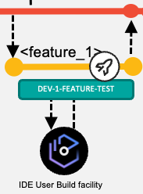
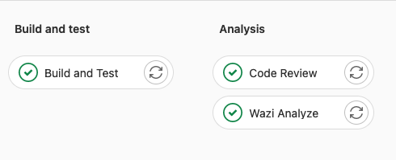
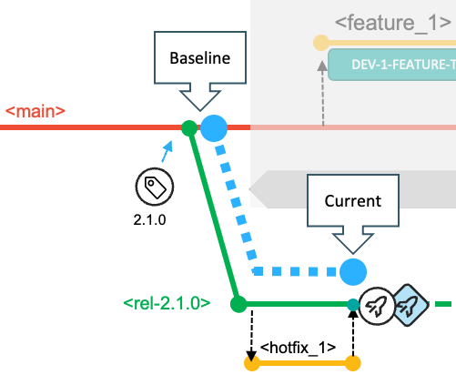
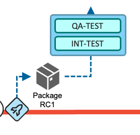
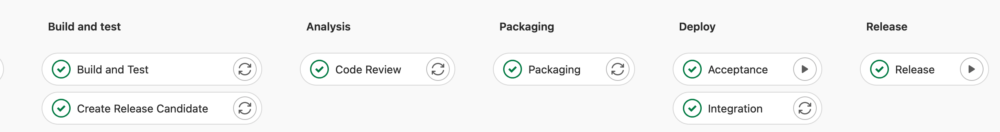
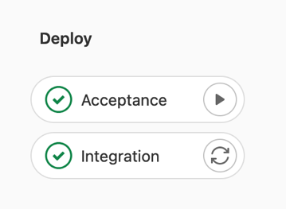

# Pipeline design and implementation supporting the branching model

This page details the technical implementation of the different continuous integration/continuous delivery (CI/CD) pipeline types used in the [Git branching model for mainframe development](./git-branching-model-for-mainframe-dev.md). If a branching model workflow demands a specific configuration, it will be covered within the same section.

## Configurations to support working with feature branches

  

When developers start working on a new task, they will first create a feature branch. Feature branches are created off the latest code state of the source configuration, whether that is the `main` branch or an epic or release maintenance branch.

If the feature branch was created on the central Git repository, the developers can use the integrated development environment (IDE), a terminal, or another Git interface on their local workstation to clone or pull the new feature branch from the central Git repository. They then switch to the feature branch to implement their changes.

IDEs supported by IBM allow developers to perform a Dependency Based Build (DBB) User Build to quickly gather feedback on the implemented changes. This feature is expected to be used before the changes are committed and pushed to the central Git server, where a pipeline can process changes automatically. Developers regularly commit and push their changes to their feature branch on the central Git provider.

### User Build setup

User Build is a capability provided by IBM-supported IDEs that uploads the modified source code and its dependencies from the local, checked-out Git working tree on the developer's workstation to a personal directory on z/OS UNIX System Services, and then invokes the build framework to execute the compile and link-edit steps. This capability is available in the following IDEs:

- [IBM Developer for z/OS](https://www.ibm.com/docs/en/developer-for-zos)

- [Microsoft Visual Studio Code (VS Code) with the IBM Z Open Editor extension](https://www.ibm.com/docs/en/cloud-paks/z-modernization-stack/2022.2?topic=ide-option-2-developing-vs-code)

- [IBM Wazi for Dev Spaces](https://www.ibm.com/docs/en/cloud-paks/z-modernization-stack/2022.2?topic=ide-option-1-developing-codeready-workspaces)

The developer configures the User Build process to point to the central build framework implementation, such as [zAppBuild](https://github.com/IBM/dbb-zappbuild), provided by the Mainframe DevOps Team. The build option [`--userBuild`](https://github.com/IBM/dbb-zappbuild/blob/3.2.0/docs/BUILD.md#build-a-single-program) is passed to the build framework along with the reference to the file the developer would like to build.

Because the operation is performed with the credentials of the currently logged-in user, it is recommended for each developer to reuse the high-level qualifier (`--hlq`) of their personal datasets. It is the developer's responsibility to regularly clean up the mainframe datasets and sandbox directories on z/OS UNIX System Services that are used for User Build. Automated cleanup of the files can be established based on a defined naming convention for datasets or with a specific storage management policy.

User Build is a convenient way to compile and link-edit source code without committing the changes into the Git version control system. Therefore, build outputs of user builds are not assumed to be installed into a runtime environment. To be able to perform simple and rudimentary tests on User Build-generated outputs, the developer should modify the test JCLs to point to the personal libraries used in user builds.

Alternatively, the setup of a pre-concatenated runtime library can be implemented to perform more tests in the context of a (shared) test runtime environment. A dedicated pre-concatenated library in the runtime system (for example, batch, IMS and CICS) into which the developers can write allows a separation of the modules produced by user builds, and enables regular cleanup of these intermediate versions that are not yet registered in the central Git provider or as a build output in the artifact repository.

External dependencies to other components, such as include files (for example, copybooks or object decks) that are not managed within the application repository but are required for building the application, can either be pulled in via a [dataset concatenation](https://github.com/IBM/dbb-zappbuild/blob/3.2.0/samples/application-conf/Cobol.properties#L83-L89) or by the usage of Git submodules, depending on the repository organization.

### Pipeline build of feature branches

It is a common practice to use a feature branch pipeline that builds the codebase of a feature branch and runs automated code inspections using the [IDz Code Review feature](https://github.com/IBM/dbb/tree/v2.0.0/Pipeline/RunIDZCodeReview) and/or updates the static code analysis repository such as in [IBM Wazi Analyze](https://www.ibm.com/docs/en/addi/6.1.2?topic=wazi-analyze-user-guide).

This pipeline expands the scope of the build past that of the user build and makes sure all changed and impacted programs are included in the list of artifacts to be produced by leveraging the `--impactBuild` option of zAppBuild. The developer must make sure to have pushed the feature branch with all their committed changes from their local clone of the repository to the central Git provider so that those changes are available to the feature branch pipeline process.

The pipeline configuration requires processing logic to compute a dedicated high-level qualifier to guarantee that build datasets are exclusively used for the provided branch. The computed value is passed into the build command via the `--hlq` parameter. zAppBuild allocates the datasets automatically.

The following screen capture shows the stages included a sample pipeline build for a feature branch.

The build leverages the dependency metadata managed by IBM Dependency Based Build via DBB collections, which are consumed by the build framework, zAppBuild. At the first execution of the build process for feature branches, zAppBuild will duplicate this metadata by cloning the related collections for efficiency purposes[^1]. This cloning phase ensures the accuracy of the dependency information for this pipeline build. To be able to clone the collection, zAppBuild needs to understand which collection contains the most accurate information and should be duplicated. As collection names are derived from the name of the branch, it is easy to identify which collection should be cloned. In the zAppBuild configuration, the originating collection reference is defined via the `mainBuildBranch`[^1] property.

Depending on the [branching model workflow](./git-branching-model-for-mainframe-dev.md#workflows-in-this-branching-model) being used, the `mainBuildBranch` property might need to be overridden for the feature branch pipeline:

- In the [default development process](./git-branching-model-for-mainframe-dev.md#deliver-changes-with-the-next-planned-release) working towards the next planned release based on the head of the `main` branch, the default configuration for the `mainBuildBranch` is accurate and does not need to be overridden.

- When [implementing a fix in context of a release maintenance branch](./git-branching-model-for-mainframe-dev.md#implement-a-fix-for-the-current-production-state), the `mainBuildBranch` must be set to the name of the release maintenance branch to correctly clone the dependency information.

- When [implementing changes on a feature branch in an epic branch context](./git-branching-model-for-mainframe-dev.md#use-an-epic-branch-for-a-significant-development-initiative), the `mainBuildBranch` property must be set to the name of the epic branch.

Instead of manipulating the property file that defines the `mainBuildBranch` setting and is part of the repository, the pipeline automation can compute the correct setting and pass the overriding property via the [override command-line option](https://github.com/IBM/dbb-zappbuild/blob/3.3.0/docs/BUILD.md#dynamically-overwrite-build-properties) of zAppBuild.

### Package and Deploy a feature for testing in controlled test environments

Today's mainframe development workflows can allow developers to install their changes into controlled test environments before these changes get assigned into a release, for instance when the developer would like to prototype/pilot a new feature. On lower environments, there might be multiple CICS regions that developers can use, which provide a level of isolation from other ongoing development work. The pipeline process can be extended to provide a similar functionality as an optional step for the developer.

This strategy is supported by feature branch packaging and deployment of a preliminary package. It is implemented as a dedicated pipeline that developers request on demand for their feature branch. The pipeline performs the following actions:

1. Build all the changes of the feature branch that were implemented, including their impacts as outlined in [Basic Build Pipeline: Build and Test stage](#basic-build-pipeline-build-and-test-stage), using the commit point at which the feature branch was branched off as the baseline reference for calculating the changes.
2. Package the generated build outputs as outlined in [Release Pipeline: Packaging stage](#release-pipeline-packaging-stage).

The deployment process must ensure that these preliminary packages cannot be deployed into any production environment.

Often, these controlled development test environments are used as shared test environments for multiple application teams. To use the same runtime environment, such as a CICS region, for both prototyping and for testing integrated changes, we recommend separating the preliminary (feature) packages from the planned release packages by separating these types into different libraries. The package for the prototyping workflow is deployed via its dedicated deployment environment model, illustrated in the above diagram as DEV-1-FEATURE-TEST.

Because preliminary packages are intended to be short-lived and temporary, they can be deployed to a library via the deployment automation process to a pre-concatenated library. Housekeeping strategies must be established to ensure that either automation routines or developers are cleaning up the preliminary packages when the testing is done.

This strategy should be designed with the infrastructure engineering team to prepare the test environments to support this workflow.

### Housekeeping recommendations

A housekeeping strategy should be implemented when the feature branch is no longer needed and therefore removed from the central Git provider. Successful merging adds commits from one branch to the head of another. Once complete, the branch the commits were merged from can be safely deleted. (Keeping old branches can cause confusion and does not contribute to the traceability of the history.) This housekeeping strategy should include the cleanup of the DBB collections, the build workspace on z/OS UNIX System Services, and the build datasets.

Specific scripts can be integrated into the pipeline to delete [collections](https://www.ibm.com/docs/en/dbb/2.0?topic=interface-collection-commands#collection-delete) and [build groups](https://www.ibm.com/docs/en/dbb/2.0?topic=interface-build-group-commands#build-group-delete), or [remove unnecessary build datasets](https://github.com/IBM/dbb/tree/main/Utilities/DeletePDS). When leveraging GitLab CI/CD as the pipeline orchestrator, the use of GitLab environments helps to automate these steps when a branch is deleted. An implementation sample is provided via the published technical document [Integrating IBM z/OS Platform in CI/CD Pipelines with Gitlab](https://www.ibm.com/support/pages/integrating-ibm-zos-platform-cicd-pipelines-gitlab). Generally, webhooks and other extensions of the pipeline orchestrator can be leveraged to perform these cleanup activities when a branch is deleted.

## The Basic Build Pipeline for main, epic, and release branches

It is common practice to build every time the head of the `main`, epic, or release branch is modified.

When a feature branch is merged into a shared integration branch, a new pipeline is kicked off to build the merged changes in the context of the configuration of the integration branch.

Additional steps such as automated code reviews or updates of application discovery repositories can be included in the pipeline process, as shown in the sample pipeline setup in the following screen capture.

### Basic Build Pipeline: Build and Test stage

The purpose of the Build and Test stage of the pipeline for an integration branch is to ensure that the branch can be built and then tested together. It might happen that some features have indirect dependencies on other features planned for the same deliverable. This early point of integration along with the [impact build capability](https://github.com/IBM/dbb-zappbuild/blob/3.2.0/docs/BUILD.md#perform-impact-build) of the zAppBuild build framework ensures consistency and transparency for the upcoming deliverable.

Conceptually speaking, the build step of a CI/CD pipeline decouples building from deploying. This is important to ensure that only outputs from successful builds are installed into the test environment, rather than directing the build framework to update the libraries of the test environment directly.

The Build and Test stage of the pipeline for the integration branch builds all the incorporated changes that have so far been merged for the deliverable. To identify the list of changes contributing to the next planned release, the release maintenance, or the epic, the build step of the pipeline leverages the `--baselineRef` option of zAppBuild for incremental builds, which is used to specify a baseline hash or point in the commit history for calculating the list of changes. Using this approach of incremental builds avoids unnecessarily building parts of the application that are unaffected by any of the changes in the commits to the base branch since the last release.

Additionally, the pipeline configuration requires a dedicated high-level qualifier to guarantee that build data sets are exclusively used for the provided branch. The value is passed to the zAppBuild command via the `--hlq` parameter.

The option `--baselineRef` is a sub-parameter of the `--impactBuild` option in zAppBuild, and sets the base Git hash upon which the `git diff` command calculates changes for the repository[^2].

In the [default workflow](./git-branching-model-for-mainframe-dev.md#deliver-changes-with-the-next-planned-release) with `main` as the base branch, the baseline reference is defined by the commit hash (or the Git tag) of the previous release (that is, the release currently in production). In the following diagram, the blue dotted line shows the changes calculated from the baseline to the point at which the `feature_2` branch is merged in.

For the [hotfix workflow](./git-branching-model-for-mainframe-dev.md#implement-a-fix-for-the-current-production-state), the hotfixes are planned to be implemented from a release maintenance branch whose baseline reference is the commit (or Git tag) that represents the state of the repository for the release. This is also the commit from which the respective release maintenance branch was created, as depicted in the below diagram.

For the [epic branch workflow](./git-branching-model-for-mainframe-dev.md#characteristics-of-mainline-based-development-with-feature-branches), the baseline reference for the build pipeline is the commit (or Release tag) from which the epic branch was created, also referred to as the fork point.

### Basic Build Pipeline: Install outputs to a development and test environment

In this phase of the development lifecycle for the [default workflow](./git-branching-model-for-mainframe-dev.md#deliver-changes-with-the-next-planned-release) implementing and delivering changes for the next planned release, the build typically operates with the compile options to enable [testing and debugging](https://github.com/IBM/dbb-zappbuild/blob/3.3.0/docs/BUILD.md#common-pipeline-invocation-examples) of programs. As most organizations restrict the deployment to the production environments with optimized code only, these build artifacts can be seen as temporary and only for initial testing and debugging purposes.

  
There are two options to deploy the generated artifacts to the shared development test system - represented by the blue DEV-TEST shape in the above figure.

(Recommended) Option A: Extend the pipeline with a packaging stage and a deployment stage to create a preliminary package similar to [Release Pipeline: Packaging stage](#release-pipeline-packaging-stage). It is traditionally the responsibility of the deployment solution to install the preliminary package into different environments. Doing so in this phase of the workflow will give the necessary traceability to understand which versions are installed in the development and test environment.

Option B: Use a post-build script to copy the output artifacts from the build libraries to the associated target runtime libraries and manually run the necessary activation steps such as a Db2 bind process or an online refresh. However, even given the temporary nature of the outputs created by this build, this circumvents the formal packaging and deployment process. The major drawback of this approach is a lack of traceability and understanding of what runs on the development and test environment.

This step of the build pipeline is also applicable for pipelines for the epic or the release maintenance branches.

### Basic Build Pipeline: Analyze stage

An optional Analyze stage after building the most current state of the `main` branch can include steps to perform automated code inspections using the [IDz Code Review feature](https://github.com/IBM/dbb/tree/v2.0.0/Pipeline/RunIDZCodeReview) and/or to update the static code analysis repository such as in [IBM Wazi Analyze](https://www.ibm.com/docs/en/addi/6.1.2?topic=wazi-analyze-user-guide).

Submitting a Sonarqube scan at this point of the workflow can also help the development team to keep an eye on the maintainability and serviceability of the application.

## The Release Pipeline with Build, Packaging, and Deploy stages

  

The Release Pipeline is leveraged by the development team when they want to create a release candidate package that can be deployed to controlled test environments. The development team manually requests the pipeline to run. The pipeline is not expected to be used for every merge into the `main` branch.

The Release Pipeline differs from the previously-discussed pipelines and includes additional steps: after the stages of building and code scans have successfully completed, the pipeline packages all the incorporated changes of all merged features for this deliverable to create a package.

The package can be an intermediate release candidate version that can already be tested in the managed test environments, as outlined in the [high-level workflows](./git-branching-model-for-mainframe-dev.md#workflows-in-this-branching-model). When the development team has implemented all the tasks planned for the iteration, this same pipeline is used to produce the package that will be deployed to production.

The following diagram outlines the steps of a GitLab pipeline for the Build, Packaging, and Deploy stages.

The Deploy stage can only be present in the pipeline for the default workflow (with `main`) when delivering changes with the next planned release, because the pipeline is unaware of the assigned environments for the epic and release maintenance workflows.

### Release Pipeline: Build stage

Similar to the build pipeline outlined in [Basic Build Pipeline: Build and Test stage](#basic-build-pipeline-build-and-test-stage), the Build stage of the Release Pipeline builds all the incorporated changes of all merged features. To identify the list of changes contributing to the deliverable, the Build stage of the pipeline leverages the `--baselineRef` option of zAppBuild to detect all contributed changes based on rules outlined in [Basic Build Pipeline: Build and Test stage](#basic-build-pipeline-build-and-test-stage).

For the `main` and the release maintenance workflows, this build performs the compilation with the compiler options to produce executables optimized for performance. The pipeline must leverage its dedicated set of PDS libraries to not interfere with the [Basic Build Pipeline](#the-basic-build-pipeline-for-main-epic-and-release-branches).

For the epic branch workflow, the build can occur with test options, as the package is only deployed into the initiative's test environment and will be rebuilt when the epic branch is integrated into the `main` branch.

### Release Pipeline: Packaging stage

The Packaging stage runs after the Build and Test stage, and creates a package of the generated build outputs (for example, load modules, DBRMs, and JCLs). This package includes the build outputs of all the contributed changes (including the files impacted by the changes) for the deliverable. It represents a release candidate that can be deployed into the various test environments along the existing staging hierarchy. As outlined in the high-level workflows, this can even happen when only a subset of the features for the deliverable is implemented.

The name or associated metadata of the package allows the development team to relate the package to the development workflow. Based on naming conventions of the package, different rules need to apply to its lifecycle. Some examples of this are shown below:

- Use `rel-2.1.0_RC01` for a release candidate package for the next planned release.

    The package name represents the name of the next planned release. This package can make it to production, as it contains build outputs produced with options for optimization.

- Use `rel-2.0.1-patch_RC01` for an urgent fix package of the current production version.

    This package is allowed to bypass any concurrent development activities and can take shortcuts in the route to production. For example, if it can only be tested on the QA-TEST environment, the developers can bypass lower test environments based on an "emergency" flag of the deployment package.

- Use `epic1-prelim_pkg01` for a preliminary package of a long-running epic branch workflow.

    This package can only be deployed to the assigned test environments available to the initiative, and cannot be deployed to production.

The Packaging stage not only creates the binaries package, but it also carries information about the source code, such as the Git commit and additional links (including references to the pipeline job), which are helpful for understanding the context of the creation of the package.

The [DBB community repository](https://github.com/IBM/dbb) contains two sample scripts that implement the Packaging stage. If IBM UrbanCode Deploy (UCD) is used as the deployment solution, the [`CreateUCDComponentVersion`](https://github.com/IBM/dbb/tree/main/Pipeline/CreateUCDComponentVersion) script can be leveraged to create an IBM UrbanCode Deploy component version. Alternatively, if a scripted deployment is being set up, the [`PackageBuildOutputs`](https://github.com/IBM/dbb/tree/main/Pipeline/PackageBuildOutputs) script can be used instead to store artifacts in an enterprise binary artifact repository leveraged by [IBM Wazi Deploy](https://www.ibm.com/docs/en/developer-for-zos/16.0?topic=deploy-wazi-workflow).

Both sample scripts leverage data from the DBB build report to extract and retain the metadata, allowing traceability between the build and deployment activities as outlined above.

### Release Pipeline: Deploy stage

The deployment process of a release package for the [default workflow with `main`](./git-branching-model-for-mainframe-dev.md#deliver-changes-with-the-next-planned-release) can either be triggered from the CI/CD pipeline or driven through the user interface of the deployment manager. The implementation can vary based on the capabilities offered by the CI/CD orchestrator and the deployment solution. Deployment manager options for z/OS include IBM UrbanCode Deploy (UCD) and IBM Wazi Deploy.

IBM UrbanCode Deploy provides a rich web-based interface, powerful REST APIs, and a command-line interface. Typically, the pipeline execution requests the deployment of the application package into the defined test environments automatically, after successful completion of the preceding Build and Packaging stages. These requests are performed through the REST APIs provided by UCD. However, if the application team prefers to set up manual triggers for the deployments to the specific environments, this can be performed through UCD's web interface. In that scenario, the pipeline is primarily used for continuous integration and packaging.

The [DBB community repository](https://github.com/IBM/dbb) provides a sample [`DeployUCDComponentVersion`](https://github.com/IBM/dbb/tree/main/Pipeline/DeployUCDComponentVersion) script that can be included in a pipeline process to request a UCD application deployment leveraging UCD's REST APIs.

IBM Wazi Deploy is a deployment manager for z/OS artifacts and comes with a command-line interface that can be easily invoked from a pipeline orchestrator and does not require a wrapper script. After retrieving the package to deploy from the artifact repository, the `wazideploy-generate` step generates the deployment instructions (also known as the deployment plan) for the artifacts of the package. This plan is then passed to the `wazideploy-deploy` step, which installs the contents of the package into the specified runtime environment[^3].

The following screen capture shows the Deploy stage of a sample Release Pipeline.

Implementation details of the Deploy stage can vary based on the pipeline orchestrator being used. In a GitLab CI/CD implementation, a pipeline can stay on hold and wait for user input. This allows the pipeline to automatically trigger the deployment of the application package into the first configured environment, and lets the application team decide when to deploy to the next environment through a manual step (for instance, deployment to the Acceptance environment).

With Jenkins as the CI/CD orchestrator, it is not common to keep a pipeline in progress over a long time. In this case, the pipeline engineering team might consider the approach of requesting the deployments through the user interface of the deployment manager, or alternatively, they can design and set up a deployment pipeline in Jenkins that can combine the deployment with any automated tests or other automation tasks.

## Deployment to production

When the release candidate package has passed all quality gates and received all the necessary approvals, it is ready to be deployed to the production environment.

The release manager takes care of this step of the lifecycle and will leverage the user interface of the deployment manager, such as UCD's browser-based interface. In the case of a deployment manager solution with a command-line interface such as Wazi Deploy, the user interface of the pipeline orchestrator is used by the release manager to drive the deployment to production. A deployment pipeline definition needs to be configured to roll out the package.

Deploying to production consists of two tasks:

1. Invoke the deployment to the production runtime environment through either the deployment manager interface or a deployment pipeline definition.

2. Tag the commit in the Git server by assigning a Git tag to the commit that was used to build the release package.

Most Git providers allow for the creation of a release to provide a summary of the changes, as well as additional documentation. [GitLab](https://docs.gitlab.com/ee/api/releases/) and [GitHub](https://docs.github.com/en/rest/releases/releases) offer REST APIs to create a new tag/release. This action should be automated as part of the deployment to production.

As an example of using Git tags, [zAppBuild](https://github.com/IBM/dbb-zappbuild/releases/tag/3.2.0) also declares releases to identify stable versions.

## Conclusion

This page provides guidance for implementing a [Git branching model for mainframe development](./git-branching-model-for-mainframe-dev.md) with IBM Dependency Based Build and zAppBuild.

The CI/CD pipeline configurations that were outlined at various stages can be adjusted depending on the application team's existing and desired development processes and philosophy. Factors that might impact the design of the pipelines and workflow include test strategies, the number of test environments, and potential testing limitations.

When designing a CI/CD pipeline, assessment of current and future requirements in the software delivery lifecycle is key. As CI/CD technologies continue to evolve and automated testing using provisioned test environments becomes more common in mainframe application development teams, the outlined branching strategy can also evolve to maximize the benefits from these advances.

[^1]: zAppBuild documentation: https://github.com/IBM/dbb-zappbuild/blob/3.2.0/docs/BUILD.md#perform-impact-build-for-topic-branches

[^2]: zAppBuild implementation to set `baselineRef`: https://github.com/IBM/dbb-zappbuild/blob/3.2.0/docs/BUILD.md#perform-impact-build-by-providing-baseline-reference-for-the-analysis-of-changed-files

[^3]: IBM Wazi Deploy static deployment workflow: https://www.ibm.com/docs/en/developer-for-zos/16.0?topic=deploy-getting-started-static-deployment