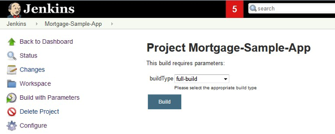

# Designing the build strategy

The build step contains all the steps to compile and link the source files into executable code. This page focuses on the different build strategies to support build scenarios at different phases of application development, and points to the relevant sections within the shared sample scripts via IBM's  [zAppBuild repository](https://github.com/IBM/dbb-zappbuild).

There are several different types of possible builds. At a high level, there is a user build, which is a build done by a developer on a single program, and a pipeline build, which will build the single or multiple changes pushed to the Git server.

Due to the nature of mainframe languages, source files need to be associated to a build type. For the build process, it is important to know what type of processing the file needs so that the correct build process can be associated with it. The correlation can be tracked through a fixed mapping list, through a folder organization, or a file extension.

Within the zAppBuild samples on GitHub, a mapping in the file `file.properties` provides the association of the file to a certain build script.

## User build

In an early development phase, developers need the ability to build the single program they are working on, as well as the unit test programs being created.

The following integrated development environment (IDE) tools provide an option to enable the developer to compile a selected program in an easy and fast way, without the need to commit or push the change to the repository, while still using the same build options defined for the pipeline build. The purpose is to build fast for the personal testing scenario:

- [IBM Developer for z/OS (IDz)](https://www.ibm.com/docs/en/developer-for-zos)
- [Wazi for Visual Studio Code](https://www.ibm.com/docs/en/cloud-paks/z-modernization-stack/2023.2?topic=code-option-1-developing-wazi-vs)
- [Wazi for Dev Spaces](https://www.ibm.com/docs/en/cloud-paks/z-modernization-stack/2023.2?topic=code-option-2-developing-wazi-dev-spaces)

Additional information about performing a user build can be found in the documentation for [IBM Dependency Based Build](https://www.ibm.com/docs/en/developer-for-zos/16.0?topic=zos-starting-user-build) and for the IDEs listed above.

## Pipeline build

A pipeline build is generally a build of a set of changes (but could also be a build of a single change), that have been pushed to the Git server. It produces the official binaries, outputs that can be packaged and deployed to different environments, including production. By having the clear definition of what went into each build and the official build outputs, this ensures there are audit records.

### Scope of pipeline builds

The continuous integration/continuous delivery (CI/CD) pipeline can kick off builds for many different scenarios, providing different overrides for each. The build scripts need to handle all these scenarios. Examples of the multiple possible build scenarios include a full build, a dependency build, and a scoped build.

A pipeline build is also possible for the short-lived topic (or feature) branches. However, the binaries resulting from this particular scenario cannot go to production because they typically lack a review and approval process.

#### Full build

A full build compiles the full defined configuration. The full list of source files is provided as input from the pipeline to the build scripts. One strategy is to allow the specification of the build type in the pipeline orchestrator, as demonstrated in the following screenshot of a Jenkins sample pipeline. The build script would then need to handle this input as the build type.

#### Impact build

Instead of a full build, most builds are dependency-based impact builds, only building the changed files and the files that depend on (or are impacted by) those changed files. However, there are different qualities of defining the scope of an impact build, which is reflected in the impact calculation phase of a build.

##### Impact calculation for dependency-based builds

The easiest strategy is to only build the modified files. How to calculate this depends on the scenario. If it is a topic branch build, this can simply be the modified files identified in the Git commit. If this is a release build, you can use a diff of the current baseline to the previous successful build baseline to calculate the modifications.

The next consideration is if you want to include the directly impacted files in the list of buildable files. This calculation for direct dependencies occurs on the source file level. If a copybook is changed, all files using this copybook are directly impacted. This level of impact calculation is managed by the IBM Dependency Based Build server. The server contains a collection representing all direct dependencies in a configuration. Your build script needs to query the dependency-based build server to retrieve the list of impacted files and pass this along to the build script. The use cases can vary. If you want to automatically rebuild programs including a modified copybook, you should pursue the strategy above. Instead of rebuilding all dependent programs, you might want to provide a function for the user to select which, if any, of these impacted files should be rebuilt.

The `ImpactUtilities.groovy` sample script for IBM Dependency Based Build in the public [zAppBuild GitHub](https://github.com/IBM/dbb-zappbuild) repository provides an example of this impact calculation.

#### User-defined build scope

While dependency-based impact builds cover strategies with a good level of automation for the build process, the user-defined build scope provides full flexibility to the user. It is up to the user to provide the list of files being considered in the build. The list could also reference a work item and its related changes. As a variation, the list can include the files from where the impact calculation should be performed.

A file containing the build list is stored as part of the repository.

Similar to the build scripts, we recommend storing the user-defined build list as part of the Git repository. Additionally, you need to consider a parameterized Jenkins job including the relevant logic, which can serve all three build types: full build, dependency-based impact build, and user-defined build.

### Strategies for orchestrated builds

As we now have shown, there are different possible build scenarios. It is important to select the right build types for your setup. Using a mixture, depending on the level, should serve your needs. At each given level the choices will be limited, with the most flexibility at the development level. If you intend to maintain the traditional library population strategy, you can implement user builds to build development activities within the development stage and set up a dependency-based impact build in the integration stage to ensure consistency across the application.

It is important to recognize that by moving to Git and using an artifact repository for outputs, you are no longer tied to a library structure. You can now use the same build configuration strategy while pulling any already-built parts out of the artifact repository.

## Resources

This page contains reformatted excerpts from [Develop Mainframe Software with OpenSource Source code managers and IBM Dependency Based Build](https://www.ibm.com/support/pages/develop-mainframe-software-opensource-source-code-managers-and-ibm-dependency-based-build).
