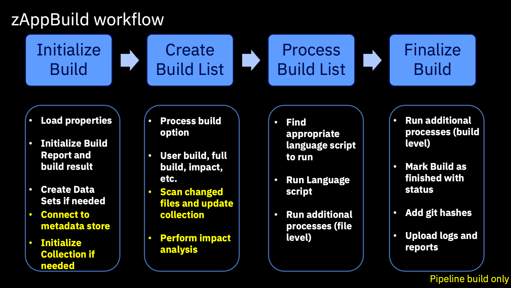
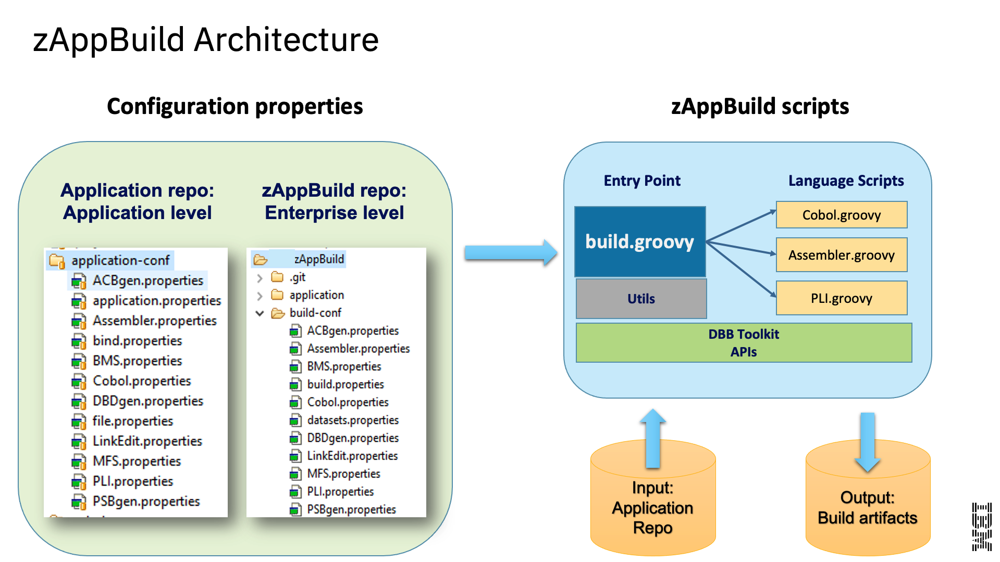

# Build

The Build component of a continuous integration/continuous delivery (CI/CD) pipeline converts the source code into executable binaries. It supports multiple platforms and languages. In mainframe environments, it includes understanding dependencies, compile, link-edit, and unit test. The build can include the inspection of code quality to perform automated validation against a set of coding rules. In some cases, code quality inspection could also be a component of its own in the pipeline.

While many of the steps in the DevOps flow for mainframe applications can be performed using the same tooling used by distributed development teams, the build step in particular needs to remain on z/OS. Therefore, in the IBM Z DevOps solution, this step is primarily handled by IBM Dependency Based Build (DBB). DBB has intelligent build capabilities where it can not only compile and link z/OS programs to produce executable binaries, but it can also perform different types of builds to support the various steps in an application development workflow. This includes the ability to  perform an "impact build", where DBB will only build programs that have changed since the last successful build and the files impacted by those changes, saving time and resources during the development process.

DBB is a set of APIs based on open-source Groovy and adapted to z/OS. This enables you to easily incorporate your z/OS application builds into the same automated CI/CD pipeline used by distributed teams. It is possible to use DBB as a basis to [write your own build scripts](https://www.ibm.com/docs/en/dbb/2.0?topic=apis-tutorial-writing-your-first-build-script), but we recommend starting with the [zAppBuild framework](https://github.com/IBM/dbb-zappbuild) to provide a template for your build, and then customizing it as necessary for your enterprise and applications.

The zAppBuild framework helps facilitate the adoption of DBB APIs for your enterprise and applications. Rather than writing your own Groovy scripts to interact with the DBB APIs, you can fill in properties to define your build options for zAppBuild, and then let zAppBuild invoke DBB to perform your builds.

## DBB features

- Perform builds on z/OS and persist build results
- Persist metadata about the builds, which can then be used in subsequent automated CI/CD pipeline steps, as well as informing future DBB builds
- Can be run from the command line interface, making it easy to integrate into an automated CI/CD pipeline

## zAppBuild features

- Framework template facilitates leveraging DBB APIs to build z/OS applications, letting you focus on defining the build's properties separately from the logic to perform the build
- High-level enterprise-wide settings that can be set for all z/OS application builds
- Application-level settings for any necessary overrides in individual application builds
- Includes out-of-the-box support for the following languages:
  - COBOL
  - PL/I
  - BMS and MFS
  - Link Cards
  - PSB, DBD
  - See zAppBuild's [Supported Languages](https://github.com/IBM/dbb-zappbuild/tree/main#build-scope) for a full list of out-of-the-box supported languages.
- Supported build actions:
  - Single program ("User Build"): Build a single program in the application
  - List of programs: Build a list of programs provided by a text file
  - Full build: Build all programs (or buildable files) of an application
  - Impact build: Build only the programs impacted by source files that have changed since the last successful build
  - Scan only: Skip the actual building and only scan source files for dependency data
  - Additional supported build actions are listed in zAppBuild's [Build Scope](https://github.com/IBM/dbb-zappbuild/tree/main#build-scope) documentation.

## zAppBuild introduction

zAppBuild is a free, generic mainframe application build framework that customers can extend to meet their DevOps needs. It is available under the Apache 2.0 license, and is a sample to get you started with building Git-based source code on z/OS UNIX System Services (z/OS UNIX). It is made up of property files to configure the build behavior, and Groovy scripts that invoke the DBB toolkit APIs.

Build properties can span across all applications (enterprise-level), one application (application-level), or individual programs. Properties that cross all applications are managed by administrators and define enterprise-wide settings such as the PDS name of the compiler, data set allocation attributes, and more. Application- and program-level properties are typically managed within the application repository itself.

The zAppBuild framework is invoked either by a developer using the "User Build" capability in their integrated development environment (IDE), or by an automated CI/CD pipeline. It supports different [build types](https://github.com/IBM/dbb-zappbuild#build-scope).

The main script of zAppBuild, `build.groovy`, initializes the build environment, identifies what to build, and invokes language scripts. This triggers the utilities and DBB APIs to then produce runtime artifacts. The build process also creates logs and an artifact manifest (`BuildReport.json`) for deployment processes coordinated by the deployment manager.

The following chart provides a high-level summary of the steps that zAppBuild performs during a build:

### zAppBuild architecture

The zAppBuild framework is split into two parts. The core build framework, called `dbb-zappbuild`, is a Git repository that contains the build scripts and stores enterprise-level settings. It resides in a permanent location on the z/OS UNIX file system (in addition to the central Git repository). It is typically owned and controlled by the central build team.

The other part of zAppBuild is the `application-conf` folder that resides within each application repository to provide application-level settings to the central build framework. These settings are owned, maintained, and updated by the application team.

#### `dbb-zappbuild` folder structure overview

- `build-conf` contains the following enterprise-level property files:
  - `build.properties` defines DBB initilization properties, including location and of the DBB metadata store (for storing dependency information) and more.
  - `dataset.properties` describes system datasets such as the PDS name of the COBOL compiler or libraries used for the subsystem. You must update this properties file with your site’s data set names.
  - Several language-specific property files that define the compiler or link-editor/binder program names, system libraries, and general system-level properties for COBOL, Assembler, and other languages.
- `languages` contains Groovy scripts used to build programs. For example, `Cobol.groovy` is called by `build.groovy` to compile the COBOL source codes. The application source code is mapped by its file extension to the language script in `application-conf/file.properties`.
- `samples` contains an `application-conf` template folder and a reference sample application, MortgageApplication.
- `utilities` contains helper scripts used by `build.groovy` and other scripts to calculate the build list.
- `build.groovy` is the main build script of zAppBuild. It takes several required command line parameters to customize the build process.

#### `application-conf` overview

This folder is located within the application's repository, and defines application-level properties such as the following:

- `application.properties` defines various directory rules, default Git branch, impact resolution rules such as the copybook lookup rules, and more.
- `file.properties` maps files to the language scripts in `dbb-zappbuild/languages`, and provides file-level property overrides.
- Property files for further customization of the language script processing. For example, `Cobol.properties` is one of the language properties files to define compiler and link-edit options, among other properties.

The following diagram illustrates how zAppBuild's application- and enterprise-level configurations feed into its build scripts to generate build artifacts from an application repository:

## Resources

- [IBM documentation for DBB](https://www.ibm.com/docs/en/dbb/2.0)
- [IBM Dependency Based Build Fundamentals course](https://ibm.github.io/mainframe-downloads/Training/dbb-self-paced-learning.html)

This page contains reformatted excerpts from the following documents:

- [DBB zAppBuild Introduction and Custom Version Maintenance Strategy](https://www.ibm.com/support/pages/node/6457275)
- [Packaging and Deployment Strategies in an Open and Modern CI/CD Pipeline focusing on Mainframe Software Development](https://www.ibm.com/support/pages/packaging-and-deployment-strategies-open-and-modern-cicd-pipeline-focusing-mainframe-software-development)
