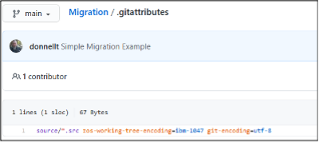
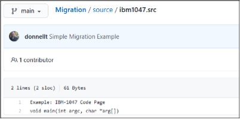
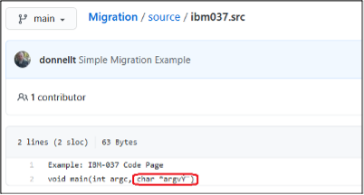
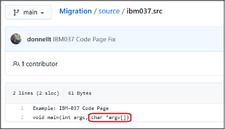
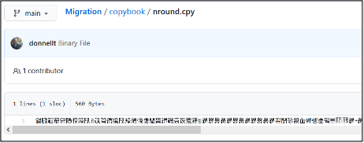

# DBB Migration Tool

## DBB Migration Tool overview

IBM® Dependency Based Build (DBB) provides a migration tool that facilitates the copying of source code PDS members into a pre-existing local Git repository in z/OS UNIX System Services (z/OS UNIX), stored on the z/OS File System (zFS). The populated local Git repository can then be committed and pushed to a distributed Git server. During the copy process, the DBB Migration Tool will perform the necessary code page conversion from the z/OS code page to the traditional code page used in Git when applicable, create (or update) the `.gitattributes` file with the correct encoding mappings, tag the z/OS UNIX files with the appropriate code page values, and (potentially) report on any issues encountered during the migration.

The migration tool is bundled as part of the SMP/e installation of the Dependency Based Build toolkit (FMID HBGZ110) and is typically found under the [`migration/bin` sub-directory](https://www.ibm.com/docs/en/dbb/2.0?topic=SS6T76_2.0.0/setup_dbb_toolkit.htm) of the DBB installation folder (which by default is `/usr/lpp/IBM/dbb`, unless customized during installation). The setup, general usage, and various options provided by this tool to assist in the migration can be found on the [IBM Documentation website](https://www.ibm.com/docs/en/dbb/2.0?topic=migrating-source-files-from-zos-git).

The following sections of this page will showcase various migration scenarios using the context that has been described in [Managing code page conversion](./managing-code-page-conversion.md). The intent is not to provide an exhaustive set of scenarios supported by the migration tool, but rather to focus on common use cases. The scenarios are:

1. [Migration using the default settings](#1-migration-using-the-default-settings)
2. [Migration using the `pdsEncoding` Mapping Rule](#2-migration-using-the-pdsencoding-mapping-rule)
3. [Detection of non-roundtripable characters](#3-detection-of-non-roundtripable-characters)
4. [Detection of non-printable characters](#4-detection-of-non-printable-characters)

## Example setup

To illustrate the scenarios, the following sample PDSs were constructed to highlight some specific migration situations that may be encountered and how to mitigate potential issues:

- [`MIGRATE.TECHDOC.SOURCE`](#migratetechdocsource)
- [`MIGRATE.TECHDOC.COPYBOOK`](#migratetechdoccopybook)

### MIGRATE.TECHDOC.SOURCE

Content of the `MIGRATE.TECHDOC.SOURCE` dataset:

<table>
  <thead>
    <tr>
      <th>Member</th>
      <th>Description</th>
    </tr>
  </thead>
  <tbody>
    <tr>
      <td>IBM037</td>
      <td>
        Member that has been created using the code page of IBM-037.<br />Example: IBM-037 Code Page
        <pre lang="c">
          void main(int argc, char *argv[])
        </pre>
        <strong>Note:</strong> Under the IBM-037 code page, the hexadecimal codes for the <code>[</code> and the <code>]</code> characters are x’BA’ and x’BB’, respectively.
      </td>
    </tr>
    <tr>
      <td>IBM1047</td>
        <td>
          Member that has been created using the code page of IBM-1047.<br />Example: IBM-1047 Code Page
          <pre lang="c">
            void main(int argc, char *argv[])
          </pre>
          <strong>Note:</strong> Under the IBM-1047 code page, the hexadecimal codes for the <code>[</code> and the <code>]</code> characters are x’AD’ and x’BD’, respectively.
      </td>
    </tr>
  </tbody>
</table>

### MIGRATE.TECHDOC.COPYBOOK

Content of the `MIGRATE.TECHDOC.COPYBOOK` dataset:
<table>
  <thead>
    <tr>
      <th>Member</th>
      <th>Description</th>
    </tr>
  </thead>
  <tbody>
    <tr>
      <td>NROUND</td>
      <td>
        Member that contains non-roundtripable characters.<br />Example: Non-roundtripable characters
        <pre lang="cobol">
          Line with CHAR_NL (0x15)  ␤<br />
          Line with CHAR_CR (0x0D)  ␍<br />
          Line with CHAR_LF (0x25)  ␊<br />
          Line with CHAR_SHIFT_IN (0x0F)  _<br />
          Line with CHAR_SHIFT_OUT(0x0E)  _<br />
          Line with empty CHAR_SHIFT_OUT(0x0E) and CHAR_SHIFT_IN (0x0F)  __
        </pre>
      </td>
    </tr>
    <tr>
      <td>NPRINT</td>
      <td>
        Member that contains non-printable characters.<br />Example: Non-Printable Characters
        <pre lang="cobol">
          Line with (0x06)  ?<br />
          Line with (0x07)  <br />
          Line with (0x1B)  
        </pre>
      </td>
    </tr>
    <tr>
      <td>HEXCODED</td>
      <td>
        Member that contains non-printable and non-roundtripable characters.<br />Example: Hexadecimal Coded Characters
        <pre lang="cobol">
          01   DFHBMSCA.<br />
          &nbsp;&nbsp;02 DFHBMPEM  PICTURE X VALUE IS '_'.<br />
          &nbsp;&nbsp;02 DFHBMPNL  PICTURE X VALUE IS '␤'.<br />
          &nbsp;&nbsp;02 DFHBMPFF  PICTURE X VALUE IS '_'.<br />
          &nbsp;&nbsp;02 DFHBMPCR  PICTURE X VALUE IS '␍'.<br />
          &nbsp;&nbsp;02 DFHBMASK  PICTURE X VALUE IS '0'.<br />
          &nbsp;&nbsp;02 DFHBMUNP  PICTURE X VALUE IS ' '.
        </pre>
      </td>
    </tr>
    <tr>
      <td>HEXVALUE</td>
      <td>
        Member that contains the suggested transformation of the non-printable or non-roundtripable characters contained in the “HEXCODED” member in a more suitable format.<br />Example: Hexadecimal Values
        <pre lang="cobol">
          01   DFHBMSCA.<br />
          &nbsp;&nbsp;02 DFHBMPEM  PICTURE X VALUE IS X'19'.<br />
          &nbsp;&nbsp;02 DFHBMPNL  PICTURE X VALUE IS X'15'.<br />
          &nbsp;&nbsp;02 DFHBMPFF  PICTURE X VALUE IS X'0C'.<br />
          &nbsp;&nbsp;02 DFHBMPCR  PICTURE X VALUE IS X'0D'.<br />
          &nbsp;&nbsp;02 DFHBMASK  PICTURE X VALUE IS '0'.<br />
          &nbsp;&nbsp;02 DFHBMUNP  PICTURE X VALUE IS ' '.
       </pre>
     </td>
    </tr>
  </tbody>
</table>

## Migration scenarios

### 1. Migration using the default settings

In this scenario, we will be migrating all the source members in the `MIGRATE.TECHDOC.SOURCE` PDS using the default settings into a local z/OS UNIX Git Repository under `/u/user1/Migration`. This is the most simplistic form of invoking the migration tool and, in most cases, satisfies most needs.

```shell
$DBB_HOME/migration/bin/migrate.sh -r /u/user1/Migration -m Mapping Rule[hlq:MIGRATE.TECHDOC,extension:SRC,toLower:true] SOURCE

Setting dbb.file.tagging = true
Local GIT repository: /u/user1/Migration
Mapping: MappingRule[hlq:MIGRATE.TECHDOC,extension:SRC,toLower:true]
MappingRuleId: com.ibm.dbb.migration.MappingRule
MappingRuleAttrs: [hlq:MIGRATE.TECHDOC, extension:SRC, toLower:true]
Using mapping rule com.ibm.dbb.migration.MappingRule to migrate the data sets
Migrating data set SOURCE
Copying MIGRATE.TECHDOC.SOURCE(IBM037) to /u/user1/Migration/source/ibm037.src using default encoding
Copying MIGRATE.TECHDOC.SOURCE(IBM1047) to /u/user1/Migration/source/ibm1047.src using default encoding
** Build finished
```

Note that the migration tool is using a default encoding, which is IBM-1047.

An examination of the files on the local z/OS UNIX Git repository will reveal that the files were copied and were tagged with the default code page of IBM-1047.

```shell
ls -alT /u/user1/Migration/source
total 64
                    drwxr-xr-x   2 USER1    OMVS        8192 May  4 12:33 .
                    drwxr-xr-x   4 USER1    OMVS        8192 May  4 12:33 ..
t IBM-1047    T=on  -rw-r--r--   1 USER1    OMVS          61 May  4 12:33 ibm037.src
t IBM-1047    T=on  -rw-r--r--   1 USER1    OMVS          61 May  4 12:33 ibm1047.src
```

Additionally, the `.gitattributes` file was created (or updated) with the correct encoding mappings. All source artifacts, except those tagged as binary (to be discussed later), will be stowed in the distributed Git server using the UTF-8 code page (as defined by the `git-encoding=utf-8` parameter), whereas any artifacts that are copied from the distributed Git server to z/OS will be translated to the IBM-1047 code page (as defined by the `zos-working-tree-encoding=ibm-1047` parameter). The documentation on [Defining the code page of files in Git](./managing-code-page-conversion.md#defining-the-code-page-of-files-in-git) provides more information.

```shell
cat /u/user1/Migration/.gitattributes
source/*.src zos-working-tree-encoding=ibm-1047 git-encoding=utf-8
```

At this point, Git actions such as add/commit/push can be performed on the migrated source artifacts to the distributed Git server.

```shell
git add .
git commit -m "Simple Migration Example"
[main 6436b92] Simple Migration Example
 3 files changed, 5 insertions(+)
 create mode 100644 .gitattributes
 create mode 100644 source/ibm037.src
 create mode 100644 source/ibm1047.src
git push
Counting objects: 6, done.
Compressing objects: 100% (6/6), done.
Writing objects: 100% (6/6), 634 bytes | 211.00 KiB/s, done.
Total 6 (delta 0), reused 0 (delta 0)
To github.ibm.com:user1/Migration.git
   3d2962a..6436b92  main -> main
```

Once the Git push command has completed to the distributed Git server, the resulting files should be translated into the correct UTF-8 code page.







However, as indicated in the last picture above, the `ibm037.src` file reveals an encoding issue. This will be discussed in the next scenario.

### 2. Migration using the pdsEncoding Mapping Rule

In this scenario, we will be migrating a single source member from the `MIGRATE.TECHDOC.SOURCE PDS` using the `pdsEncoding` keyword in the mapping rule to override the default encoding. Recall that from the previous migration scenario, there was an encoding issue with the final copy of the `ibm037.src` file in the distributed Git server. This occurred because the z/OS file was written using the IBM-037 code page instead of the default IBM-1047 code page. The problem is not in how the file was encoded, but rather how the Rocket Git client converted the file when sending it to Git.

This can be a common occurrence for source files that pre-date the introduction of z/OS Unix System Services (z/OS UNIX), and where high-level languages, such as C/370, were utilized. As stated previously, determining the original encoding can be a challenge since the code page used to create the file is generally specified in the 3270 Emulator (TN3270) client session set-up. Therefore, an analysis of the z/OS source should be performed to determine the original code page used to create the source. To determine the code page used to create files through ISPF, an alternate option is to ask the developers which code page they are using to edit the files through their 3270 connections.

To correct the encoding issue identified in the previous scenario, we will use the `pdsEncoding` keyword of the mapping rule to override the default IBM-1047 code page with IBM-037 for the offending member.

```shell
$DBB_HOME/migration/bin/migrate.sh -r /u/user1/Migration -m MappingRule[hlq:MIGRATE.TECHDOC,extension:SRC,toLower:true,pdsEncoding:IBM-037] "SOURCE(IBM037)"

Setting dbb.file.tagging = true
Local GIT repository: /u/user1/Migration
Mapping: MappingRule[hlq:MIGRATE.TECHDOC,extension:SRC,toLower:true,pdsEncoding:IBM-037]
MappingRuleId: com.ibm.dbb.migration.MappingRule
MappingRuleAttrs: [hlq:MIGRATE.TECHDOC, extension:SRC, toLower:true, pdsEncoding:IBM-037]
Using mapping rule com.ibm.dbb.migration.MappingRule to migrate the data sets
Migrating data set SOURCE(IBM037)
Copying MIGRATE.TECHDOC.SOURCE(IBM037) to /u/user1/Migration/source/ibm037.src using IBM-037
** Build finished
```

Note that the migration tool is using the override encoding of IBM-037 for a named member. This override does not necessarily have to be performed on a member-by-member basis, as the migration tool supports the ability to override the encoding for an entire PDS being migrated.

An examination of the files on the local z/OS UNIX Git repository will reveal that the file was copied and tagged with the override code page of IBM-037.

```shell
ls -alT /u/user1/Migration/source
total 64
                    drwxr-xr-x   2 USER1    OMVS        8192 May  4 13:10 .
                    drwxr-xr-x   4 USER1    OMVS        8192 May  4 13:10 ..
t IBM-037     T=on  -rw-r--r--   1 USER1    OMVS          61 May  4 14:54 ibm037.src
t IBM-1047    T=on  -rw-r--r--   1 USER1    OMVS          61 May  4 13:10 ibm1047.src
```

Additionally, the `.gitattributes` file was updated with the correct encoding mappings:

```shell
cat /u/user1/Migration/.gitattributes
source/*.src zos-working-tree-encoding=ibm-1047 git-encoding=utf-8
source/*.src zos-working-tree-encoding=IBM-037 git-encoding=utf-8
```

However, in this example you will notice a slight anomaly in that there are two (2) entries for the same sub-folder source/*.src. This will cause an encoding conflict during the Git add action. To correct this situation, the `.gitattributes` file must be manually updated to add the file name. Wild cards can be used in the file name should there be more than one member that matches this situation. The order of these entries is important, with the last entry taking precedence. In some cases, additional wild carding may be required to prevent further conflicts.

```shell
cat /u/user1/Migration/.gitattributes
source/*.src zos-working-tree-encoding=ibm-1047 git-encoding=utf-8
source/ibm037.src zos-working-tree-encoding=IBM-037 git-encoding=utf-8
```

Once the correction has been made to the `.gitattributes` file, the Git commit and push actions can be performed on the updated files to the distributed Git server:

```shell
git add .
git commit -m "IBM037 Code Page Fix"
[main 107c86c] IBM037 Code Page Fix
 2 files changed, 2 insertions(+), 1 deletion(-)
git push
Counting objects: 5, done.
Compressing objects: 100% (5/5), done.
Writing objects: 100% (5/5), 485 bytes | 485.00 KiB/s, done.
Total 5 (delta 2), reused 0 (delta 0)
To github.ibm.com:user1/Migration.git
   6436b92..107c86c  main -> main   3d2962a..6436b92  main -> main
```

Now when examining the offending file on the distributed Git server, the contents of the file should be translated correctly:



The probability that members of a single PDS were written using a different code page, though possible, is extremely low. However, it is worth pointing out that it could expose an issue in how the migration tool generates the `.gitattributes` file.

### 3. Detection of non-roundtripable characters

In this scenario, we will examine how the migration tool can assist in the detection of what is known as non-roundtripable characters. The documentation on [Managing non-printable and non-roundtripable characters](./managing-code-page-conversion.md#managing-non-printable-and-non-roundtripable-characters) provides more conceptual background information. To illustrate this, we will be migrating the single source member `MIGRATE.TECHDOC.COPYBOOK(NROUND)`, which contains both types of characters.

During the migration of a PDS member to a z/OS UNIX file, the migration tool will scan the content of the file to see if it detects any non-roundtripable characters. These characters are defined in the `migrate.groovy` script and are:

```groovy
@Field def CHAR_NL = 0x15
@Field def CHAR_CR = 0x0D
@Field def CHAR_LF = 0x25
@Field def CHAR_SHIFT_IN = 0x0F
@Field def CHAR_SHIFT_OUT = 0x0E
```

If detected, the migration tool will emit a diagnostic message in the console log and will copy the member to z/OS UNIX as binary and therefore no code page conversion will be performed:

```shell
$DBB_HOME/migration/bin/migrate.sh -r /u/user1/Migration -m MappingRule[hlq:MIGRATE.TECHDOC,extension:CPY,toLower:true,pdsEncoding:IBM-037] "COPYBOOK(NROUND)"

Local GIT repository: /u/user1/Migration
Using mapping rule com.ibm.dbb.migration.MappingRule to migrate the data sets
Migrating data set COPYBOOK(NROUND)
[WARNING] Copying MIGRATE.TECHDOC.COPYBOOK(NROUND) to /u/user1/Migration/copybook/nround.cpy
 ! Possible migration issue:
      Line 2 contains non-roundtripable characters:
        Char 0x15 at column 27
      Line 3 contains non-roundtripable characters:
        Char 0x0D at column 27
      Line 4 contains non-roundtripable characters:
        Char 0x25 at column 27
      Line 7 contains non-roundtripable characters:
        Empty Shift Out and Shift In at column 74

 ! Copying using BINARY mode
** Build finished
```

Note that the migration tool has detected numerous non-roundtripable characters on various lines and has performed the copy as binary.

An examination of the files on the local z/OS UNIX Git Repository will reveal that the file was copied but left untagged (this is a current known limitation for the DBB Toolkit in its 1.1.3 version, and a workaround is available upon request).

```shell
ls -alT /u/user1/Migration/copybook
total 48
                    drwxr-xr-x   2 USER1    OMVS        8192 May  6 13:42 .
                    drwxr-xr-x   4 USER1    OMVS        8192 May  6 13:42 ..
- untagged    T=off -rw-r--r--   1 USER1    OMVS         560 May  6 13:42 nround.cpy
```

To be processed by the Rocket Git client when performing the Git add command, the file should be manually tagged as binary first. To correctly tag the file as binary, use the `chtag -b` command prior to performing the Git add command:

```shell
ls -alT /u/user1/Migration/copybook
total 48
                    drwxr-xr-x   2 USER1    OMVS        8192 May  8 13:10 .
                    drwxr-xr-x   5 USER1    OMVS        8192 May  8 13:12 ..
b binary      T=off -rw-r--r--   1 USER1    OMVS         560 May  8 13:10 nround.cpy
```

Additionally, the `.gitattributes` file was automatically updated by the migration script to indicate that the file is mapped as binary:

```shell
cat /u/user1/Migration/.gitattributes
copybook/nround.cpy binary
```

During the Git push to the distributed Git server, Git will treat this as a binary file and no conversion to UTF-8 will take place. In essence, the resulting file on the distributed Git server will be the original contents of the PDS member, in EBCDIC.

```shell
git add .
warning: copybook/nround.cpy added file have been automatically tagged BINARY because they were untagged yet the .gitattributes file specifies they should be tagged
git commit -m "Binary File"
[main 0213795] Binary File
 2 files changed, 1 insertion(+)
 create mode 100644 .gitattributes
 create mode 100644 copybook/nround.cpy
git push
Counting objects: 5, done.
Compressing objects: 100% (3/3), done.
Writing objects: 100% (5/5), 598 bytes | 598.00 KiB/s, done.
Total 5 (delta 0), reused 0 (delta 0)
To github.ibm.com:user1/Migration.git
   e901992..0213795  main -> main
```

Once the Git push action has completed to the distributed Git server, the resulting file will be treated as binary:



This may not be an ideal situation as described in the documentation on [Managing non-printable and non-roundtripable characters](./managing-code-page-conversion.md#managing-non-printable-and-non-roundtripable-characters), and should be corrected/reconciled before continuing with the migration.

### 4. Detection of non-printable characters

In this final scenario, we will examine how the migration tool can assist in the detection of what is known as non-printable characters. The documentation on [Managing non-printable and non-roundtripable characters](./managing-code-page-conversion.md#managing-non-printable-and-non-roundtripable-characters) provides more conceptual background information. To illustrate this, we will again migrate the single source member `MIGRATE.TECHDOC.COPYBOOK(NPRINT)`, which only contains non-printable characters.

During the migration of a PDS member to a z/OS UNIX file, the migration tool will scan the content of the file to see if it detects any non-printable characters. These characters are defined as any hexadecimal values that are an EBCDIC x’40’ or less, and not one of the five (5) non-roundtripable characters.

The migration tool provides three (3) options on how to handle and report on these characters:

1. Do Not Check: The non-printable characters are not researched; the member is simply copied as text. Code page conversion will occur.
2. Info: The script will emit an Informational diagnostic message in the console log if a non-printable  character is detected and the file is copied as text. Code page conversion will occur.
3. Warning: The script will emit a Warning diagnostic message in the console log if a non-printable character is detected and the file is copied as binary. No code page conversion will occur, and the offending characters will be treated like non-roundtripable characters.

It should be noted that for the “Do Not Check” and “Info” options, although code page conversion is taking place, this could cause an issue later. The file may not be easily maintained with a distributed editor, and you run the risk of having corrupted files.

Controlling what level of checking should be performed during the migration is done via the optional scan level `-np`, `--non-printable <level>` parameter switch passed to the migration script. If the scan level parameter is not specified, the non-printable characters are not checked (equates to the “Do Not Check” option).

#### Scan level set to `info`

Example output for migration performed with scan level set to `info`:

```shell
$DBB_HOME/migration/bin/migrate.sh -r /u/user1/Migration -np info -m MappingRule[hlq:MIGRATE.TECHDOC,extension:CPY,toLower:true,pdsEncoding:IBM-037] "COPYBOOK(NPRINT)"

Non-printable scan level is info
Local GIT repository: /u/user1/Migration
Using mapping rule com.ibm.dbb.migration.MappingRule to migrate the data sets
Migrating data set COPYBOOK(NPRINT)
[INFO] Copying MIGRATE.TECHDOC.COPYBOOK(NPRINT) to /u/user1/Migration/copybook/nprint.cpy using IBM-037
 ! Possible migration issue:
      Line 2 contains non-printable characters:
        Char 0x00 at column 19
      Line 3 contains non-printable characters:
        Char 0x06 at column 19
      Line 4 contains non-printable characters:
        Char 0x07 at column 19
      Line 5 contains non-printable characters:
        Char 0x1B at column 19

** Build finished
```

Note that the migration tool has detected numerous non-printable characters on various lines and has performed the copy as text and will be tagged on z/OS UNIX using the supplied encoding of IBM-037:

```shell
ls -alT /u/user1/Migration/copybook
total 64
                    drwxr-xr-x   2 USER1    OMVS        8192 May  6 15:39 .
                    drwxr-xr-x   4 USER1    OMVS        8192 May  6 14:55 ..
t IBM-037     T=on  -rw-r--r--   1 USER1    OMVS         114 May  6 15:39 nprint.cpy
```

#### Scan level set to warning

Example output for migration performed with scan level set to `warning`:

```shell
$DBB_HOME/migration/bin/migrate.sh -r /u/user1/Migration -np warning -m MappingRule[hlq:MIGRATE.TECHDOC,extension:CPY,toLower:true,pdsEncoding:IBM-037] "COPYBOOK(NPRINT)"

Non-printable scan level is warning
Local GIT repository: /u/user1/Migration
Using mapping rule com.ibm.dbb.migration.MappingRule to migrate the data sets
Migrating data set COPYBOOK(NPRINT)
[WARNING] Copying MIGRATE.TECHDOC.COPYBOOK(NPRINT) to /u/user1/Migration/copybook/nprint.cpy
 ! Possible migration issue:
      Line 2 contains non-printable characters:
        Char 0x06 at column 19
      Line 3 contains non-printable characters:
        Char 0x07 at column 19
      Line 4 contains non-printable characters:
        Char 0x1B at column 19

 ! Copying using BINARY mode
** Build finished
```

Note that the migration tool has detected numerous non-printable characters on various lines and has performed the copy as binary. The file remains untagged on z/OS UNIX (the manual tagging of the file is still required):

```shell
ls -alT /u/user1/Migration/copybook
total 48
                    drwxr-xr-x   2 USER1    OMVS        8192 May  6 17:17 .
                    drwxr-xr-x   4 USER1    OMVS        8192 May  6 17:17 ..
- untagged    T=off -rw-r--r--   1 USER1    OMVS         320 May  6 17:17 nprint.cpy
```

## Recommendations for using the migration utility

A strategy must be decided on how to handle both non-printable and non-roundtripable characters found in source members that are to be migrated from z/OS PDSs to Git. The `HEXCODED` member, though not demonstrated in the above scenarios, is a common occurrence in many older legacy applications. Source code members such as this need to be identified and transformed to that shown in the `HEXVALUE` member if the goal is to manage the source seamlessly using the modernized tooling provided through Git. For more conceptual background information, please refer to [Managing non-printable and non-roundtripable characters](./managing-code-page-conversion.md#managing-non-printable-and-non-roundtripable-characters).

The DBB Migration Tool provides an option to perform a scan of the z/OS PDSs to assist in the analysis and correction/reconciliation of these situations prior to performing the copy to the local Git repository. Invoking this scan is done via the optional preview `-p`, `--preview` parameter switch and will bypass the copy.  The default is “No Preview”. An example of the preview follows:

```shell
$DBB_HOME/migration/bin/migrate.sh -r /u/user1/Migration -np warning -p -m MappingRule[hlq:MIGRATE.TECHDOC,extension:CPY,toLower:true,pdsEncoding:IBM-037] COPYBOOK

Non-printable scan level is warning
Preview flag is specified, no members will be copied to HFS
Local GIT repository: /u/user1/Migration
Using mapping rule com.ibm.dbb.migration.MappingRule to migrate the data sets
Migrating data set COPYBOOK
[WARNING] Previewing MIGRATE.TECHDOC.COPYBOOK(HEXCODED)
 ! Possible migration issue:
      Line 3 contains non-printable characters:
        Char 0x19 at column 37
      Line 4 contains non-roundtripable characters:
        Char 0x15 at column 37
      Line 5 contains non-printable characters:
        Char 0x0C at column 37
      Line 6 contains non-roundtripable characters:
        Char 0x0D at column 37

 ! Will copy using BINARY mode
Previewing MIGRATE.TECHDOC.COPYBOOK(HEXVALUE). Using IBM-037.
[WARNING] Previewing MIGRATE.TECHDOC.COPYBOOK(NPRINT)
 ! Possible migration issue:
      Line 2 contains non-printable characters:
        Char 0x06 at column 19
      Line 3 contains non-printable characters:
        Char 0x07 at column 19
      Line 4 contains non-printable characters:
        Char 0x1B at column 19

 ! Will copy using BINARY mode
[WARNING] Previewing MIGRATE.TECHDOC.COPYBOOK(NROUND)
 ! Possible migration issue:
      Line 2 contains non-roundtripable characters:
        Char 0x15 at column 27
      Line 3 contains non-roundtripable characters:
        Char 0x0D at column 27
      Line 4 contains non-roundtripable characters:
        Char 0x25 at column 27
      Line 5 contains non-printable characters:
        Char 0x0F at column 33
      Line 7 contains non-roundtripable characters:
        Empty Shift Out and Shift In at column 74

 ! Will copy using BINARY mode
```

With the `-l`, `--log` option, a log file can be created to contain all the messages about the migration process, including the non-printable and non-roundtripable characters encountered during the scan. This log file can be used by the developers to perform the necessary changes in their original source code members prior to the real migration process.

Many other options of the Mapping Rule parameter can be leveraged to control the behavior of the DBB Migration Tool. These options are described on the [IBM Documentation website](https://www.ibm.com/docs/en/dbb/2.0?topic=migrating-source-files-from-zos-git).

## Migrating from IBM Engineering Workflow Management to GIT

For specific information on using the DBB Migration Tool to migrate from IBM Engineering Workflow Management (EWM) to Git, please reference [Migrating from IBM Engineering Workflow Management (EWM) to GIT](https://www.ibm.com/support/pages/node/6538618).

## Resources

- This page contains reformatted excerpts from [Managing the code page conversion when migrating z/OS source files to Git](https://www.ibm.com/support/pages/node/6591177).