# The Git branching model for mainframe development

As Git became the de facto version control system in today's IT world, new terminologies such as "[repositories](https://git-scm.com/book/en/v2/Git-Basics-Getting-a-Git-Repository)", "[branches](https://git-scm.com/book/en/v2/Git-Branching-Branches-in-a-Nutshell)", and "merges" arose. By agreeing upon a central Git server to integrate and consolidate changes, development teams were able to collaborate more efficiently and effectively. Building upon the open-source vanilla Git implementation, popular Git providers including GitHub, GitLab, and Bitbucket have implemented additional workflow features to facilitate a secure and stable development process. These include features such as pull requests (sometimes referred to as "merge requests") to support coordination with Git in larger teams. The term "pull request" will be used throughout this page to designate the operation of reviewing and merging one branch into another.

Many mainframe development teams follow a release-based or iteration-based process to deliver incremental updates to a pre-defined production runtime.

## Characteristics of mainline-based development with feature branches

As mentioned in the [Introduction to branching models](./branching-models.md), our recommended approach scales very well to support the needs of a range of team sizes, frequency and size of changes, and degrees of concurrent working.

### Starting simple

The mainline-based development approach[^1] with short-lived feature branches is a simple and structured workflow to implement, integrate, and deliver changes with an early integration process flow using a single long-living branch: `main`. Developers work in isolation in feature branches to implement changes to the source code, and ideally test the changes in a specific environment. Each feature branch (sometimes referred to as a "[topic branch](https://git-scm.com/book/en/v2/Git-Branching-Branching-Workflows#_topic_branch)") is dedicated to a specific developer task such as a feature or bug fix.

This approach can be compared to a trunk-based branching model that leverages feature branches. A similar workflow is also documented by Microsoft without giving it a name.[^2]

The `main` branch is the point of reference for the entire history of the mainline changes to the code base, and should be a protected branch. All changes should originate on a separate branch created to hold them until they are ready to be merged. Using a branch-and-merge approach is natural in a Git-based development workflow, and is very lightweight both in terms of resource consumption and developer experience.

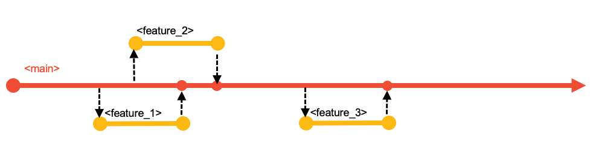

#### All changes start on a dedicated branch

Although all Git-based DevOps services provide direct access to the server copy of the code repository, developers will typically use an integrated development environment (IDE) of their choice to work locally on a clone of the repository. Standard practices ensure developers' local clones are synchronized with the server copy (typically known as the "remote") through actions known as "pull" and "push". (For those unfamiliar with Git terminology, these terms are explained in finer detail in [Source code management](./scm.md#git-basics).)

In a small team where there is almost never more than one change in progress at a time, using a branch enables the developer to make the changes in a series of commits rather than as one atomic change as they edit source and save files. Of course, the "one-line" change might mean there genuinely is only one commit that needs merging, but the process is so natural and light-weight that it is not worth making that a special case.

Such branches are able to be built prior to merging - this can eliminate the possibility of the merge breaking the build of `main`, thus reducing the risk in making changes.

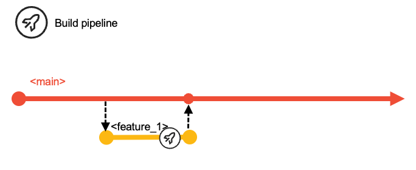

#### Merging a branch

A branch holds all the commits for a change - be that a single commit for a one-liner or a sequence of commits as the developer refined the change while making it ready for review and merging into `main`.

The request to merge a branch is made explicitly, but can be as formal or informal as needed by the team. Protection of `main` can mean that only certain people can perform the merge, or that a review and approval of the change is required before merging it, or both.

The action of merging can either simply take all the commits from the branch and add them to `main`, or that multiple commits in the branch can be "[squashed](https://git-scm.com/book/en/v2/Git-Tools-Rewriting-History#_squashing)" into one commit - the latter can keep the overall history on `main` "cleaner" if that's important to the team.

`main` should always build successfully, enabling the team to choose when to package and deploy.

### Scaling up

The use of branches for concurrently planned activities scales extremely well for busier teams. Additionally, [epic](https://scaledagileframework.com/epic/) and release maintenance branches accommodate specific development workflows and allow the model to scale even further. The latter two branches exist for the duration of the epic or release maintenance and are short-living branches.

The implemented changes of the iteration are then delivered collectively as part of the next release. Each development team decides how long an iteration is. We advocate for working towards smaller, quicker release cycles, but this model can also be used with longer iterations. Due to business or technical reasons, the merging of features into the `main` branch can also be delayed. Although this scenario is a discouraged practice, the recommendation in this case is to group such features into a specific epic branch, as described later.

This branching model leverages Git tags to identify the various configurations/versions of the application, such as a release candidate or the version of the application repository that is deployed to production.

Depending on the type of change, the development workflow can vary. In the standard scenario, developers use the `main` branch to deliver changes for the next planned release, while the release maintenance branches allow fixing of the current release running in the production runtime environment(s). Using epic branches is optional for development teams, but is a grouping mechanism for multiple features that should be built and tested together, thus allowing teams to increase the concurrency of working on multiple, larger development initiatives of the application. The epic branch also represents a way to manage the lifecycle of features that are not planned for the next planned release. In this way, it is a vehicle to delay merging the set of features into the `main` branch for a later time.

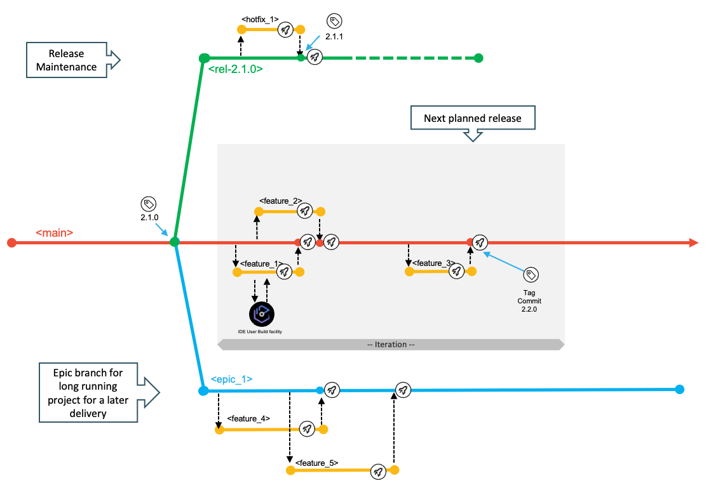

The `main`, epic, and release branches are assumed to be protected branches, meaning that no developer can directly push changes to these configurations. It requires developers to make changes on a feature branch and go through the pull request process. Before merging the feature branch into a shared branch (whether it is the `main` branch or an epic branch), some evidence should be gathered to ensure quality and respect of the coding standards in the enterprise. Peer-reviewed code, a clean pipeline execution, and approvals are examples of such evidence, allowing the development team to confidently merge the feature branch into the target branch. In a continuous integration workflow, integrations are expected to happen early to avoid delaying merge conflicts or merges leading to an unstable build.

### Naming conventions

Consistent branch naming conventions help indicate the context for the work that is performed. Throughout this document, the following naming patterns are used:

- `main`: The only long-living branch which is the only branch from which every release is initially derived

- `release/rel-2.0.1`: The release maintenance branch for an example release named rel-2.0.1

- `epic/ai-fraud-detection`: An epic branch where "aiFraudDetection" is describing the initiative context (in this example, an initiative to adopt AI technology for fraud detection)

Feature branches also need to relate back to the change request (or issue) from the planning phase and their context. Some examples are shown in the following list:

- `feature/new-mortgage-calculation` for a planned feature for the next planned release

- `hotfix/rel-2.0.1/fix-mortgage-calculation` for a fix of the current production version that is running the rel-2.0.1 release

- `ai-fraud-detection/introduce-ai-model-to-mortgage-calculation` for a contribution to the development initiative for adopting AI technology for fraud detection.

A common, recommended practice is to squash the different commits created on the feature branch into a single new commit when merging, which keeps the Git history from becoming cluttered with intermediate work for the feature. This also helps to maintain a tidy history on the `main` branch with only the important commits.

### Integration branches

Specific branches, such as `main`, epic, and release branches can be seen as integration branches, because their purpose is to integrate changes from other branches (typically feature branches). To drive the integration process of changes into a shared branch of code, mechanisms like pull requests are a convenient way as they guide the developers with a streamlined workflow. The number of integration branches required for your development process depends on the needs of the application team. However, while the cost of creating new branches is low, keeping them up-to-date, for instance by integrating release bugfixes from the stabilization phase into concurrent epic branches, can be expensive.

For application teams who want to embrace an agile development methodology and who sequentially deliver new releases with limited parallel development initiatives, they can use the `main` branch and, optionally, the release maintenance branch as integration branches to implement the next planned release and potential bug fixes. The following diagram illustrates a branching model for a Git-based development process with sequential release deliveries.

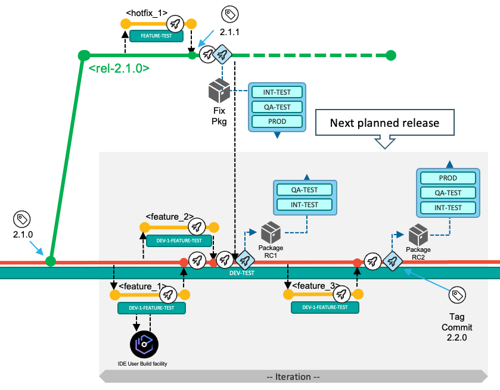

If the development teams need to work on a significant development initiative in parallel to the standard scenario of the next planned release, this model allows isolation using the epic branch workflow. The epic branch (`epic_1`) in the following branching diagram represents an additional integration branch that is used to implement, build, and test multiple features that are planned for the development initiative and can be merged into the `main` branch at a later time. The team decides which commit/tag of the codebase in the `main` branch will be used as the base for the epic branch, although it is recommended to start from the last tag for the `main` branch.

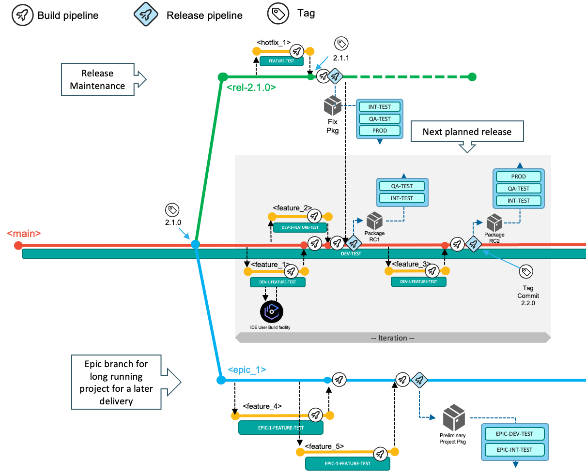

When the work items implemented on the epic branch are planned and ready to be delivered as part of the next planned release, the development team merges the epic branch into the `main` branch.

Epic branches can be used to compose various styles of development processes. The documentation for [Development process variations](./branching-appendix.md#development-process-variations) provides additional samples.

## Workflows in this branching model

This branching model facilitates three different types of development workflows:

1. (Default development workflow) [Deliver changes with the next planned release](#deliver-changes-with-the-next-planned-release): With a single long-living branch, the development process allows developers to work and focus on the next planned release. After planning the work items for the next release, the development team is adding changes to the `main` branch by merging in pull requests for feature branches.
2. [Implement a fix for the current production state](#implement-a-fix-for-the-current-production-state): This workflow enables development teams to resolve a production problem in the currently-released version of the application by leveraging a release branch that is used for maintenance purposes.
3. [Use an epic branch for a significant development initiative](#use-an-epic-branch-for-a-significant-development-initiative): Concurrent development activities for a significant solution development initiative that includes multiple planned work items for a later delivery (which could even be starting the development of a future release) are supported by creating an epic branch from a commit point in the history of `main`.

Git tags are used throughout this process to indicate and label important commits, such as the commit of a release that is built from the `main` branch, or a maintenance release created from a release maintenance branch.

The next sections outline the various tasks and activities performed by the development team in the context of the above three scenarios.

### Deliver changes with the next planned release

The following diagram depicts the typical workflow to deliver changes for the next planned release. In the default workflow, the development team commits changes to the head of the `main` branch. The changes of the next planned release are built, packaged, and released from the `main` branch.

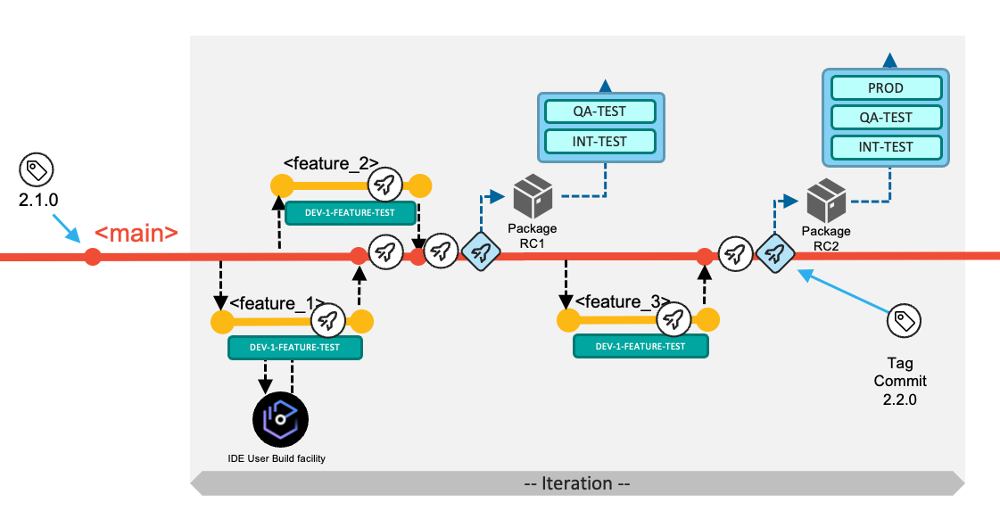

Developers implement their changes by committing to short-living feature branches (visualized in yellow), and integrate those via pull requests into the long-living `main` branch (visualized in red), which is configured to be a protected branch.

At a high level, the development team works through the following tasks:

1. New work items are managed in the backlog. The team decides which work items will be implemented in the next iteration. Each application team can decide on the duration of the iteration (which can also be seen as the development cycle). In the above diagram, three work items (Feature 1, Feature 2, and Feature 3) were selected to be implemented for the next iteration. The development team is responsible for coordinating if features are required to be implemented in a specific order.

2. For each work item, a feature branch is created according to pre-defined naming conventions, allowing the assigned developers to have a copy of the codebase on which they can work in isolation from other concurrent development activities.

    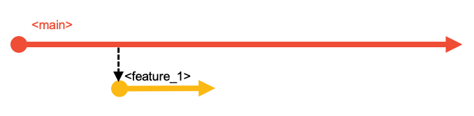

3. To start making the necessary modifications for their development task, developers create a copy of the Git repository on their local workstations through Git's clone operation. If they already have a local clone of the repository, they can simply update their local clone with the latest changes from the central Git repository by fetching or pulling updates into their local clone. This process makes the feature branch available for the developers to work with on their local workstation. They can then open their local clone of the repository in their integrated development environment (IDE), and switch to the feature branch to make their code changes.

4. Developers use the Dependency Based Build (DBB) User Build facility of their IDE to validate their code changes before committing the changes to their feature branch and pushing the feature branch with their updates to the central Git repository. (Tip: Feature branches created locally can also be pushed to the central Git server).

    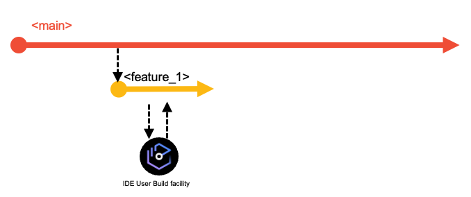

    :::tip

    This branching model is also known as a continuous integration model to reduce merge conflicts. While developing on the feature branch, a common practice is for developers to regularly sync their feature branch with the `main` branch by merging the latest changes from the `main` branch into their feature branch. This ensures that developers are operating based on a recent state of `main`, and helps to identify any potential merge conflicts so that they can resolve them in their feature branch.

    :::

5. Developers test their changes before requesting to integrate them into the shared codebase. For example, they can test the build outputs of the User Build step. For a more integrated experience, the CI/CD pipeline orchestrator can be configured to run a pipeline for the feature branch on the central Git server each time the developers push their committed changes to it. This process will start a consolidated build that includes the changed and impacted programs within the application scope. Unit tests can be automated for this pipeline, as well. To continue even further testing the feature branch, the developer might want to validate the build results in a controlled test environment, which is made possible by an optional process to create a [preliminary package for the feature branch](./branching-model-supporting-pipeline.md#package-and-deploy-a-feature-for-testing-in-controlled-test-environments).

    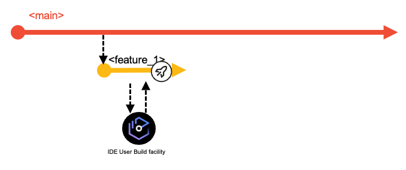

6. When developers feel their code changes are ready to be integrated back into the shared `main` branch, they create a pull request asking to integrate the changes from their feature branch into the `main` branch. The pull request process provides the capability to add peer review and approval steps before allowing the changes to be merged. As a basic best practice, the changes must be buildable. If the pull request is associated with a feature branch pipeline, this pipeline can also run automated builds of the code in the pull request along with tests and code quality scans.

7. Once the pull request is merged into the `main` branch, the next execution of the [Basic Build Pipeline](./branching-model-supporting-pipeline.md#the-basic-build-pipeline-for-main-epic-and-release-branches) will build all the changes (and their impacts) of the iteration based on the `main` branch.

    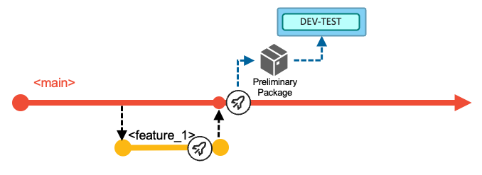  

    The pipeline can optionally include a stage to deploy the built artifacts (load modules, DBRMs, and so on) into a shared test environment, as highlighted by the blue DEV-TEST icon in the above diagram. In this DEV-TEST environment, the development team can validate their combined changes. This first test environment helps support a shift-left testing strategy by providing a sandbox with the necessary setup and materials for developers to test their changes early. The installation happens through the packaging and deployment process of a preliminary package that cannot be installed to higher environments (because it is compiled with test options), or alternatively through a simplified script solution performing a copy operation. In the latter, no inventory and no deployment history of the DEV-TEST system exist.

8. In the example scenario for this workflow, the development team decides after implementing Feature 1 and Feature 2 to progress further in the delivery process and build a release candidate package based on the current state of the `main` branch. With this decision, the development team manually runs the [Release Pipeline](./branching-model-supporting-pipeline#the-release-pipeline-with-build-package-and-deploy-stages). This pipeline rebuilds the contributed changes for this iteration - with the compiler options to produce executables optimized for performance rather than for debug. The pipeline includes an additional stage to package the build outputs and create a release candidate package (Package RC1 in the following diagram), which is stored in a binary artifact repository.

    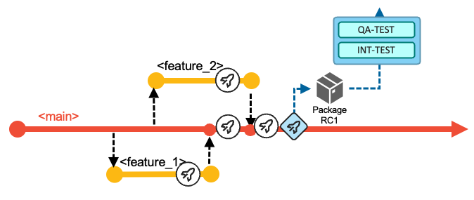

     Although not depicted in the above diagram, this point in `main`'s history can be tagged to identify it as a release candidate.

9. The release candidate package is installed in the various test stages and takes a predefined route. The process can be assisted by the pipeline orchestrator itself, or the development team can use the deployment manager. In the event of a defect being found in the new code of the release candidate package, the developer creates a feature branch from the `main` branch, corrects the issue, and merges it back into the `main` branch (while still following the normal pull request process). It is expected that the new release candidate package with the fix is required to pass all the quality gates and to be tested again.

10. In this sample walkthrough of an iteration, the development of the third work item (Feature 3) is started later. The same steps as above apply for the developer of this work item. After merging the changes back into the `main` branch, the team uses the [Basic Build Pipeline](./branching-model-supporting-pipeline.md#the-basic-build-pipeline-for-main-epic-and-release-branches) to validate the changes in the DEV-TEST environment. To create a release candidate package, they make use of the [Release Pipeline](./branching-model-supporting-pipeline.md#the-release-pipeline-with-build-package-and-deploy-stages). This package (Package RC2 in the following diagram) now includes all the changes delivered for this iteration -- Feature 1, Feature 2 and Feature 3.

    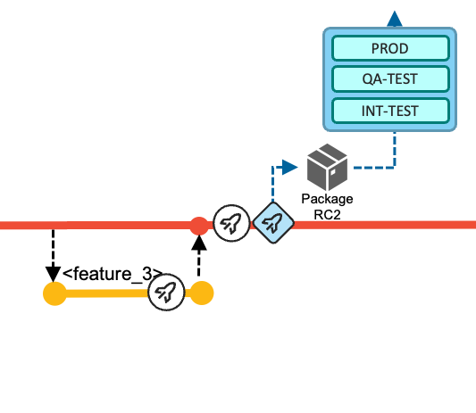

11. When the release is ready to be shipped after all quality gates have passed successfully and the required approvals have been issued by the appropriate reviewers, the deployment of the package from the binary artifact repository to the production runtime environment is performed via the deployment manager or is initiated from the [Release Pipeline](./branching-model-supporting-pipeline.md#deployment-to-production).

12. Finally, during the release process to the production environment, the state of the repository (that is, the commit) from which the release candidate package was produced is tagged following a [semantic versioning strategy](https://semver.org/). This serves to identify what version is currently in production, and also serves as the baseline reference for the calculation of changes for the next release.

    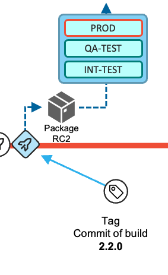

### Implement a fix for the current production state

The process of urgent fixes for modules in the production environment follows the fix-forward approach, rather than rolling back the affected modules and reverting to the previous deployed state.

The following diagram depicts the maintenance process to deliver a fix or maintenance for the active release in production for the application. The process leverages a release maintenance branch to control and manage the fixes. The purpose of the branch is to add maintenance to a release that is already deployed to the production environment. It does not serve the process to add new functionality to a future release, which is covered by the [default workflow](#deliver-changes-with-the-next-planned-release) or the usage of an [epic branch](#use-an-epic-branch-for-a-significant-development-initiative).

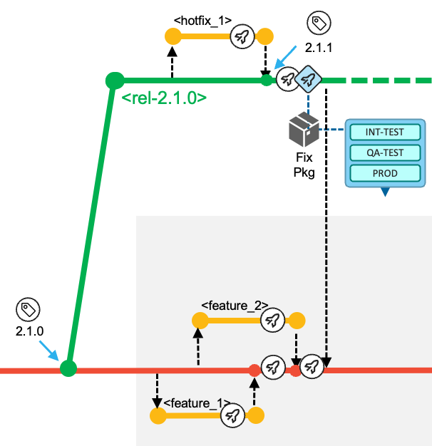

When implementing a fix for the current production state, the development team works through the following tasks:

1. In the event of a required fix or urgent maintenance for the production runtime, which in this example is currently running the 2.1.0 release, the development team creates a `release/rel-2.1.0` branch based on the existing Git tag in the central Git server. The release branch is a protected branch and does not allow developers to directly push commits to this branch.
    - **Note**: In the diagrams for this workflow, the `release/rel-2.1.0` branch is abbreviated to `rel-2.1.0` for readability. Other multi-segmented branch names are similarly abbreviated to their last segment name in the diagrams.

2. For each necessary fix, a feature branch is created according to pre-defined naming conventions (for example, `rel-2.1.0/hotfix_1`, based on the `release/rel-2.1.0` branch). This allows the assigned developer to have a copy of the codebase on which they can work in isolation from other development activities.

    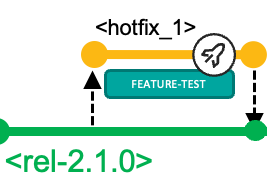  

3. The developers fetch the feature branch from the central Git repository into their local clone of the repository and switch to that branch to start making the necessary modifications. They leverage the user build facility of their IDE to vet out any syntax issues. They can use a [feature branch pipeline](./branching-model-supporting-pipeline.md#pipeline-build-of-feature-branches) to build the changed and impacted files. Optionally, the developer can prepare a [preliminary package](./branching-model-supporting-pipeline.md#package-and-deploy-a-feature-for-testing-in-controlled-test-environments), which can be used for validating the fix in a controlled test environment.

4. The developer initiates the pull request process, which provides the ability to add peer review and approval steps before allowing the changes to be merged into the `release/rel-2.1.0` release maintenance branch.

5. A [Basic Build Pipeline](./branching-model-supporting-pipeline.md#the-basic-build-pipeline-for-main-epic-and-release-branches) for the release maintenance branch will build all the changes (and their impacts).

6. The developer requests a [Release Pipeline](./branching-model-supporting-pipeline.md#the-release-pipeline-with-build-package-and-deploy-stages) for the `release/rel-2.1.0` branch that builds the changes (and their impacts), and that includes the packaging process to create the fix package for the production runtime. The developer will test the package in the applicable test environments, as shown in the following diagram.

    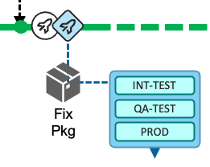  

7. After collecting the necessary approvals, the fix package can be deployed to the [production environment](./branching-model-supporting-pipeline.md#deployment-to-production). To indicate the new state of the production runtime, the developer creates a Git tag (`2.1.1` in this example) for the commit that was used to create the fix package. This tag indicates the currently-deployed version of the application.

8. Finally, the developer is responsible for starting the pull request process to merge the changes from the `release/rel-2.1.0` branch back to the `main` branch to also include the fix into the next release.

9. The `release/rel-2.1.0` branch is retained in case another fix is needed for the active release. The release maintenance branch becomes obsolete when the next planned release (whose starting point is represented by a more recent commit on the `main` branch) is deployed to production. In this event, the new commit point on the `main` branch becomes the baseline for a new release maintenance branch.

#### Working with fixes and features

...

### Use an epic branch for a significant development initiative

Let us now focus on change requests that represent significant work effort and require major changes, for instance, due to updates in regulatory frameworks in the banking or insurance industry, or the need to already kick off the development phase of features not planned to be delivered in the very next release.

In these situations, the development team cannot follow the business-as-usual workflow to deliver functionality with the next planned release, because the time and work required breaks out of the traditional durations of one release. For each of these scenarios, the development team is using an epic branch to keep the changes in multiple features separated from the other development activities. It is an integration branch to group and integrate multiple features that are planned for this initiative. Ideally, the team has a dedicated test environment assigned (such as EPIC-DEV-TEST and EPIC-INT-TEST in the following diagram), to also plan and implement any infrastructure updates such as Db2 schema changes.

Trunk-based development suggests using feature flags within the code to implement complex features via the main workflow while allowing the delay of their activation. Feature flags are often employed so that a given business functionality can be activated at a given date, but be implemented and deployed earlier (whether to dev/test or production environments). We do not see this as a common practice for traditional mainframe languages such as COBOL or PL/I, although some development organizations might apply this practice in mainframe development.

All these scenarios lead to the requirement on the development process to implement changes independently from the [main workflow](#deliver-changes-with-the-next-planned-release).

Note that the epic branch workflow described in this section is not meant to be used for a single, small feature that a developer wants to hold back for an upcoming release. In those smaller cases, the developer retains the feature branch until the change is planned to be released.

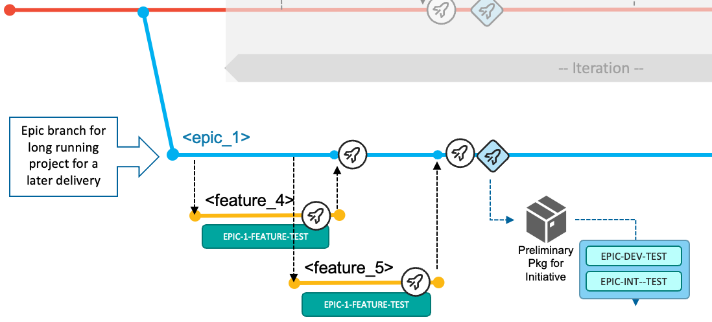

The development tasks for a development initiative are:

1. The team creates an epic branch from the Git tag representing the current production version of the application, which is at this point the most stable configuration. This process provides them isolation of the codebase from any other ongoing changes for the next iteration(s). In this workflow example, the epic branch is named `epic/epic_1`, and is abbreviated in the diagrams as `epic_1`.

2. Based on how the work items are distributed between the developers, a feature branch is created according to pre-defined naming conventions such as `epic_1/feature_4`, based on the `epic/epic_1` branch.

3. The developers fetch the feature branch from the central Git repository into their local clone of the repository and switch to that branch to start making the necessary modifications. They leverage the user build facility of their IDE for building and testing individual programs. They can also leverage [a feature branch pipeline](./branching-model-supporting-pipeline.md#pipeline-build-of-feature-branches) to build the changed and impacted files. Optionally, the developer can prepare a preliminary package, which can be used for validating the fix in a [controlled test environment](./branching-model-supporting-pipeline.md#package-and-deploy-a-feature-for-testing-in-controlled-test-environments), such as the EPIC-1-FEATURE-TEST environment shown in the following diagram.

    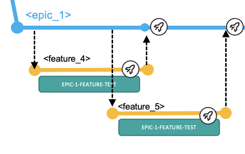  

4. The developer initiates the pull request process, which provides the ability to add peer review and approval steps before allowing the changes to be merged into the epic branch.

5. A [Basic Build Pipeline](./branching-model-supporting-pipeline.md#the-basic-build-pipeline-for-main-epic-and-release-branches) for the epic branch will build all the merged features (both the changes and their impacts) from the point where the epic branch was branched off.

6. It is important that the team frequently incorporates updates that have been implemented for the next release and/or released to production via the [default development workflow](#deliver-changes-with-the-next-planned-release) (with the `main` branch) into the epic branch to prevent the configurations from diverging too much and making the eventual merge of the epic branch into `main` difficult. A common practice is to integrate changes from `main` into the epic branch at least after each completion of a release via the default workflow, in order to merge in the latest stable version updates. More frequent integrations may lead to pulling intermediate versions of features that might not be fully implemented from a business perspective; however, this should not deter developers since the `main` branch should always be in a buildable state.

7. When the development team feels that they are ready to prototype the changes for the initiative in the initiative's test environment, they request a [Release Pipeline](./branching-model-supporting-pipeline.md#the-release-pipeline-with-build-package-and-deploy-stages) for the epic branch that builds the changes (and their impacts) and includes the packaging process to create a preliminary package. This preliminary package can then be installed into the initiative's test environment (for example, the EPIC-DEV-TEST environment). The team will test the package in the assigned test environments for this initiative, as shown in the following diagram.

    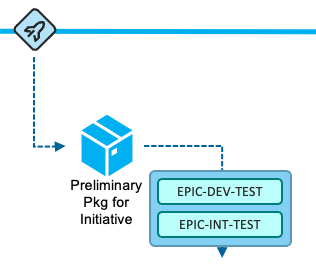  

8. Once the team is satisfied with their changes for the development initiative, they plan to integrate the changes of the epic branch into the `main` branch using the pull request process. This happens when the changes should be released towards production with the next planned iteration. The following diagram depicts of the process of integrating the changes implemented for `epic/epic_1` in parallel with the [default workflow](#deliver-changes-with-the-next-planned-release) after three releases.

    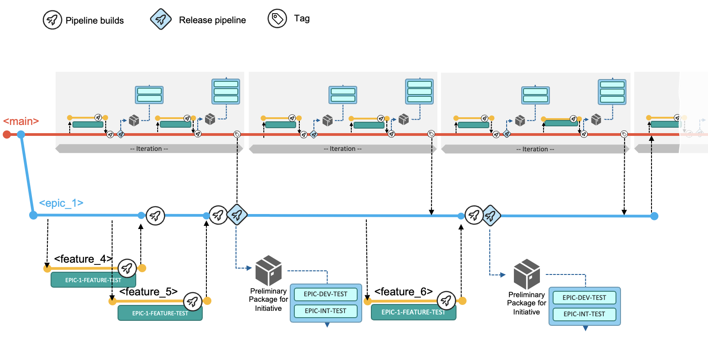

## Learn more

This page describes our recommended Git branching model and workflows for mainframe development. This model is intended to be used as a template, and can be adjusted, scaled up, or scaled down according to the needs of the development team. Additional variations for the branching strategies and workflows can be found in the [Appendix](./branching-appendix.md).

For recommendations on designing and implementing the workflows described in this branching model, please refer to [Pipeline design and implementation supporting the branching model](./branching-model-supporting-pipeline.md).

[^1]: Trunk-based development approach, also sometimes called "mainline-based" development: https://trunkbaseddevelopment.com/#scaled-trunk-based-development
[^2]: Git branching model documented by Microsoft: https://learn.microsoft.com/en-us/azure/devops/repos/git/git-branching-guidance?view=azure-devops
