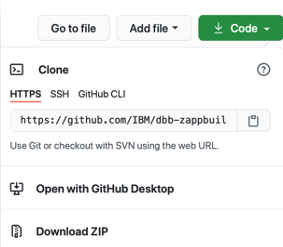
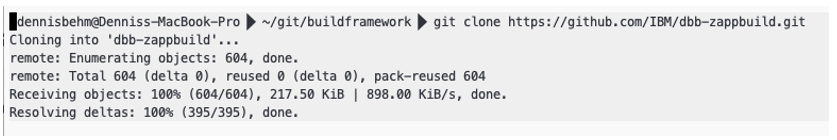
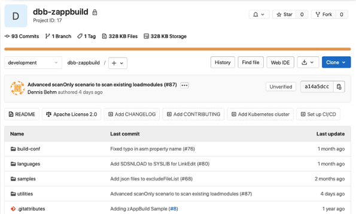
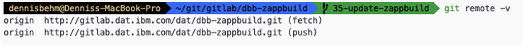
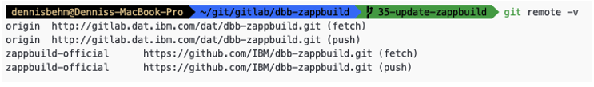
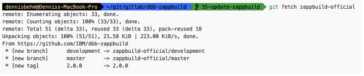
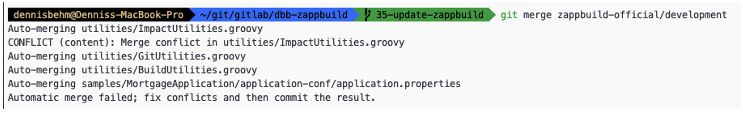
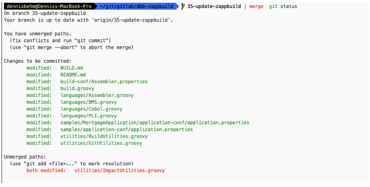

import Tabs from '@theme/Tabs';
import TabItem from '@theme/TabItem';

# Installing and configuring your tools

Installation/set-up instructions and links to installation documentation for specific products. Git, DBB, and zAppBuild are required. Generally, most enterprises will pick one technology from each component category, although sometimes more than one IDE option is selected (depending on developer preference).

**Note:** We have listed common options for each CI/CD component below. However, if you do not see the option your enterprise has selected for a particular component, that does not necessarily mean it cannot be part of your IBM Z DevOps solution. For most tools being used on the distributed side, you can integrate it into the pipeline as long as it is compatible with z/OS application development and brings value to your enterprise.

Not sure what tool to pick for certain CI/CD component? See our documentation on [How do you select what tool to use for each component](./intro-cicd-zos.md#how-do-you-select-what-tool-to-use-for-each-component).

## Integrated development environment

Who needs to install the integrated development environment (IDE), and where?

- The integrated development environment (IDE) will need to be installed by z/OS application developers on their local workstations.
- Some IDE options have host components that require a system programmer to configure.

### IDE options

<Tabs>
  <TabItem value="idz" label="IBM Developer for z/OS">

  [IBM Developer for z/OS (IDz)](https://www.ibm.com/docs/en/developer-for-zos): Eclipse-based IDE

  Additional useful tools: [Groovy development environment in IDz](https://www.ibm.com/support/pages/system/files/inline-files/Setup-Groovy-Development-Environment-in-IDZ_V1.1.2_0.pdf)

  </TabItem>
  <TabItem value="vsCode" label="Wazi for VS Code">

  [Wazi for VS Code](https://www.ibm.com/docs/en/cloud-paks/z-modernization-stack/2023.2?topic=code-option-1-developing-wazi-vs): Visual Studio Code IDE with IBM Z Open Editor and Debug extensions)

  </TabItem>
  <TabItem value="browserBased" label="Wazi for Dev Spaces">

  [Wazi for Dev Spaces](https://www.ibm.com/docs/en/cloud-paks/z-modernization-stack/2023.2?topic=code-option-2-developing-wazi-dev-spaces): Browser-based IDE
  
  Note: If you are using Wazi Dev Spaces (browser-based IDE), developers will not have to install the IDE.

  </TabItem>
</Tabs>

## Source code management

The IBM Z DevOps solution supports Git as the SCM. Clients can pick from several Git providers, including those listed in the following [Git provider options](#git-provider-options) section.

Who needs to install the source code management (SCM), and where?

- Regardless of the Git provider selected, Git will need to be installed on both developer machines, and on z/OS.
  - Developer machines: Developers can obtain Git the same way they would in distributed development.
  - z/OS: The Rocket distribution of Git is specifically ported for z/OS, and can be installed by a system programmer.

In addition to installing Git, the Git provider should also be configured. (Usually by the enterprise's team that handles the Git provider for the distributed side will help provide the basic organization or repository setup for the z/OS application team(s), and then the z/OS/DevOps team will maintain these repositories.)

### Git provider options

- Azure Repos
- Bitbucket
- GitHub
- GitLab

## Build

IBM Dependency Based Build (DBB) is the build tool in the IBM Z DevOps solution. This is complemented by the zAppBuild framework, which helps facilitate your build process using DBB APIs. Many clients start by using zAppBuild and enhancing it to their needs, for example by adding new language scripts, or by modifying the existing build processing logic.

This section provides a set of instructions for how you can make zAppBuild available in your Git provider and how to synchronize new features of zAppBuild into your customized fork.

**Note:** zAppBuild releases new versions through the `main` branch. New contributions are added first to the `develop` branch, which then will be reviewed and merged to the `main` branch.

The [IBM DBB samples repository](https://github.com/IBM/dbb) contains additional utilities that enhance or integrate with the other DBB build processes.

Who needs to install DBB, and where?

- System programmers install DBB toolkit on z/OS.
  - Set up Db2 for z/OS or Db2 for LUW (Linux, UNIX, and Windows) for the DBB metadata store.
  - See IBM Documentation on [Installing and configuring DBB](https://www.ibm.com/docs/en/dbb/2.0?topic=installing-configuring-dbb).
- Developers using IDz as their IDE must add the [DBB integration](https://www.ibm.com/docs/en/developer-for-zos/16.0?topic=integrating-dependency-based-build-developer-zos) to their installation of IDz in order to use DBB's user build feature.

Who needs to set up zAppBuild (and the IBM DBB samples repository), and where?

- The build engineer and/or DevOps team (in [DAT roles](./journey-to-cicd.md#roles): Build specialist and/or Pipeline specialist) should set this up with the enterprise's Git provider.
  - Steps for making a copy of the zAppBuild repository available in your enterprise's preferred Git provider are provided in the [following section](#making-zappbuild-available-in-your-git-provider).
  - If the IBM DBB samples repository is needed, it can be copied from its [IBM GitHub page](https://github.com/IBM/dbb) to your Git provider in a similar manner to the zAppBuild repository.

### Making zAppBuild available in your Git provider

Before you start your customization of zAppBuild, you must first create a clone of IBM's zAppBuild repository and store the clone in your Git provider of choice. This could be any Git provider, such as GitHub, GitLab, Bitbucket or Azure Repos, and so on. If you have done this already, feel free to move to the next section.

Here are the steps to make the zAppBuild repository available in a central repository on your Git provider:

1. On your local workstation, use your browser and log on to your Git provider. Follow the instructions in your Git provider to create a new repository, which will be the new “home” of your customized version of zAppBuild.
    1. We suggest "dbb-zappbuild" as the new repository/project name, but you can use another name if you prefer.
    1. Set the repository's visibility according to your needs.
    1. Do not initialize the repository yet.
        - Your Git provider will create the repository, but it is not yet initialized. On most Git providers, the repository creation process will end on a page with information on how to share an existing Git repository. Leave the browser open.
1. Clone IBM's public [zAppBuild](https://github.com/IBM/dbb-zappbuild) repository to your local workstation. You can use your local workstation's terminal to complete this step (for example, Git Bash in Windows, or Terminal on MacOS).
    - If you are using IBM Developer for z/OS (IDz) as your IDE, you can use its [Local Shell](https://www.ibm.com/docs/en/developer-for-zos/16.0?topic=view-running-viewing-commands-using-remote-shell). Wazi for VS Code and Wazi for Dev Spaces also both have Terminal windows. (We documented the steps in this guide using a terminal.)
    1. In the terminal, navigate to the folder where you would like to clone the repository.
    1. Retrieve the Git repository URL or SSH path from IBM's public zAppBuild repository from https://github.com/IBM/dbb-zappbuild:

        
    1. In your terminal, enter the command for cloning the repository. (The following command uses the Git repository URL, but the SSH path can also be used if you have SSH keys set up.):

        ```shell
        git clone https://github.com/IBM/dbb-zappbuild.git
        ```

        - Example Git clone command with output in a terminal:

          
1. Follow the instructions of your Git provider to push the contents of your newly-cloned local repository (from Step 2) to the central repository on your Git provider (created in Step 1). (Note: Exact instructions may vary from Git provider to Git provider.)
    1. Within the terminal session, execute the following commands to push an existing Git repository:
        - Replace `<existing_repo>` with the path to your newly-cloned local repository.
        - Replace `<Your central Git repository>` with the URL to the new central repository on your Git provider. (For example, with GitLab as the Git provider, the URL might look similar to `git@gitlab.dat.ibm.com:DAT/dbb-zappbuild.git`.)

        ```shell
        cd <existing_repo>
        git remote rename origin old-origin
        git remote add origin <Your central Git repository>
        git push -u origin –all
        git push -u origin --tags
        ```

    1. On the Git provider's webpage for your new central repository in the browser, you will find that the repository is now populated with all of zAppBuild's files and history, just like on IBM's public [zAppBuild](https://github.com/IBM/dbb-zappbuild) repository.
        - The following screenshot shows an example of a populated central zAppBuild repository with GitLab as the Git provider:

            

### Updating your customized version of zAppBuild

To update your customized version of zAppBuild with latest official zAppBuild enhancements, you can integrate the latest official zAppBuild features into your version of zAppBuild. So, let’s get started.

1. Locate the internal Git repository and create a new Git branch. This is a good practice to validate the changes first. In this example, the new branch is called `update-zappbuild`.
1. Add a new Git remote definition to connect to IBM's official public zAppBuild GitHub repository. (Note: This step requires internet connectivity.)
    1. First, list the remotes by issuing `git remote -v`:

        

        - For more on Git remotes, see the [git-remote](https://git-scm.com/docs/git-remote) documentation.

    1. Add a new remote named `zappbuild-official` to connect to GitHub by issuing the following command:

        ```shell
        git remote add zappbuild-official https://github.com/IBM/dbb-zappbuild.git
        ```

    1. Verify that the new remote is available by issuing the command to list the remotes again: `git remote -v`:

        

    1. Fetch the latest information from the official repository, by executing a Git fetch for the official dbb-zappubuild repository:

        ```shell
        git fetch zappbuild-official
        ```

        

    1. Make sure that your feature branch is checked out, before attempting to merge the changes from zappbuild-official. To merge the changes run into your branch `update-zappbuild`, run the following command:

        ```shell
        git merge zappbuild-official/main
        ```

        

        Potentially, you face merge conflicts. In the above case, the merge processor could not automatically resolve the `utilities/ImpactUtilities.groovy`.

        Run the command `git status` to see which files changed:

        

    1. Open the unmerged files and resolve them manually. Either use the terminal, or an IDE for this task.

        :::tip

        The Git integration in many modern IDEs (for example, VS Code) is able to provide a side-by-side comparison highlighting the diff between your feature branch and the incoming changes from the merge attempt (in this case, from `zappbuild-official`). This can help make manual resolution of any merge conflicts much easier.

        :::

    1. Commit the changes and verify them with a sample application before committing it (or opening a pull request to commit it) to your main branch that is used for all your production DBB builds.


## Artifact repository

The artifact repository is often already in-place as part of the enterprise's distributed CI/CD pipeline.

Who needs to set up the artifact repository, and where?

- Generally, the DevOps team (pipeline specialist) will work to set this up for z/OS application teams, as well.

### Artifact repository options

- Azure Artifacts
- JFrog Artifactory
- Sonatype Nexus
- UrbanCode Deploy (UCD) CodeStation

## Deployment manager

Who needs to install the deployment manager, and where?

- Depending on the software selected, the deployment manager might require an agent on the z/OS side, which can be set up by a system programmer (infrastructure team). (Alternatively, the pipeline orchestrator could SSH into z/OS.)

### Deployment manager options

- UrbanCode Deploy (UCD)
- Wazi Deploy

## Pipeline orchestrator

The artifact repository is often already in-place as part of the enterprise's distributed CI/CD pipeline.

Who needs to set up the pipeline orchestrator, and where?

- Generally, the DevOps team (pipeline specialist) will work to set this up for z/OS application teams, as well.
- The pipeline orchestrator often requires an agent or runner on the z/OS side, which can be set up by a system programmer (infrastructure team). (Alternatively, the pipeline orchestrator could SSH into z/OS.)

### Pipeline orchestrator options

- Azure Pipeline
- GitHub Actions
- GitLab CI
- Jenkins

## Resources

This page contains reformatted excerpts from the following documents:

- [DBB zAppBuild Introduction and Custom Version Maintenance Strategy](https://www.ibm.com/support/pages/node/6457275)
