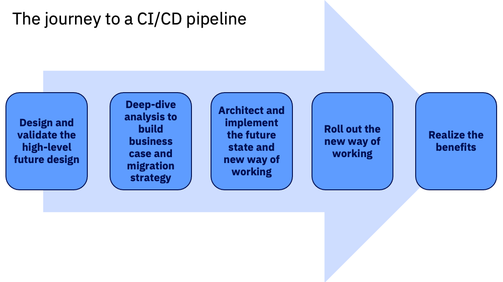

# Understanding the journey to a CI/CD pipeline

What is involved in the migration effort from green screen to CI/CD?

- Have the right tools (CI/CD pipeline tools): The major components are summarized in the [CI/CD for z/OS applications page](./intro-cicd-zos.md#components-of-a-ci-cd-pipeline-for-z-os-applications).
- Have the right people (Roles): The DevOps transformation journey includes a range of roles to help accomplish the various milestones along the way. For example, the enterprise will need roles to architect the CI/CD pipeline and workflows, implement the infrastructure, understand how to use the CI/CD tools, and so on. You can read more about each role in the [Roles](#roles) section.
  - IBM and business partners can also help support you at different milestones of your journey to the CI/CD pipeline. Available resources are described for each milestone in the [Migration journey milestones](#migration-journey-milestones) section.
- Have the right mindset: Migrating from legacy tooling and development processes to DevOps and CI/CD often requires work to bring about cultural change in the organization. In fact, many successful DevOps migration efforts involve a change transformation specialist to help the teams impacted by this migration understand the concepts and workflows behind the DevOps change and the benefits they bring.

## Migration approaches

The migration to a Git-based CI/CD pipeline can be approached in a couple different ways. A "big-bang" migration approach involves designing and implementing the future state, migrating code from z/OS to the Git provider, and training all the developers on the new way of working while the legacy system is still in place and active. Then, at a given conversion date, all developers will switch to using the new CI/CD pipeline, with the caveats that they will have received training in a short timeframe and that the pipeline will support all workflows from day one.

However, many enterprises prefer a "phased" migration approach, with the iterative migration of applications from the legacy system to the new CI/CD pipeline. The phased migration approach begins by designing the future state, and then training and migrating just one (or a couple) complete application team(s) at a time to the new CI/CD pipeline. Additional applications are subsequently onboarded to the new CI/CD pipeline over several iterations. This iterative process allows the organization to find and iron out wrinkles in the migration process and/or pipeline on a smaller scale, and then apply the experience and improve for later iterations. By the time the enterprise is mostly using the CI/CD pipeline, the migration process will be more familiar, and the switch from the legacy system to the modern CI/CD pipeline becomes much less disruptive. Application dependencies across the new CI/CD pipeline and the legacy system are expected during the iterative migration process, but the IBM Z DevOps Acceleration Team (DAT) can provide resources that help you establish processes to address this period of co-existence.

## Roles

Having a team with the right skills and mindset is critical to a successful DevOps transformation effort. While the following roles each have their own specific skillsets and tasks, an individual can perform more than one role if it makes sense for their team and organization. You can click on each role to learn about it.

  

  ### Architect

  The architect helps define the new software delivery process.

  

  Generally, the architect will be someone with strong z/OS skills who understands the infrastructure and current build processes. This deep background knowledge about the current z/OS infrastructure state and mainframe application build processes is important for understanding how to translate those processes into the more modern DevOps pipeline.

  A key task is to condense existing mainframe workflows and design the to-be state in the CI/CD pipeline. For this, the architect collaborates with the distributed teams to create a common enterprise software delivery processes. Additionally, the architect is involved in defining necessary integration points of the pipeline, as well as designing the migration process.

  - Background skills and knowledge:
    - Strong z/OS skills (average of about 10 years of experience)
    - Knowledge about mainframe development processes and workflows
  - Skills and concepts to learn:
    - CI/CD and DevOps principles
    - Git concepts and architecture
  - Tasks:
    - Collaborate between the mainframe development team(s) and distributed teams to transform the existing mainframe workflows into the to-be CI/CD pipeline
  - Job positions that you might find filling this role:
    - Enterprise architect
    - Enterprise application architect
    - IT architect

  

  ### Build specialist

  The build specialist develops and maintains the build scripts for the new pipeline.

  

  This is a developer type of role that focuses on turning the source code into a deployable artifact, so familiarity with z/OS build processes is required. The build specialist might adapt a distributed example of build scripting to z/OS.

  - Background skills and knowledge:
    - Mainframe build fundamentals (for example, JCL/REXX, understanding of compile/link/bind options, and so on)
  - Skills and concepts to learn:
    - Git concepts
    - IBM Dependency Based Build architecture (for example, dependency management and build results)
    - Groovy scripting
  - Tasks:
    - Plan and perform migrations
    - Develop and maintain the customized build framework
  - Job positions that might fill this role:
    - Build engineer
    - z/OS build administrator

  

  ### Pipeline specialist

  The pipeline specialist assembles the pipeline in the CI/CD orchestrator.

  

  This is a developer type of role that focuses on building, scaling, and maintaining the CI/CD pipeline structure. The pipeline specialist does not need to be as z/OS-aligned as the build specialist. Rather than being concerned with building COBOL programs (or other z/OS languages), the pipeline specialist is more concerned about integrating tools together. This role often already exists in the distributed side of the enterprise.

  Typically, the pipeline specialist is the first role to adopt the DevOps tooling, and then teaches the tools and workflows to other teams in the organization (for example, z/OS application development teams).

  - Background skills and knowledge:
    - CI/CD specialist
    - Git concepts
    - Change management integrations
  - Skills and concepts to learn:
    - Foundational IBM DBB concepts
    - Groovy, Shell scripting
  - Tasks:
    - Develop and maintain customized integration scripts between the different pipeline building blocks (for example, using Groovy and Shell scripting)
  - Job positions that might fill this role:
    - DevOps engineer
    - DevOps pipeline administrator
    - DevOps team

  

  ### Change transformation specialist

  The change transformation specialist drives the cultural and organizational change required for a successful modernization journey.

  

  This role is more of a consulting and people-focused role rather than a technical one. Enterprises sometimes hire an individual specifically for this role when embarking on the DevOps transformation journey - for example, someone with specialized training in coaching DevOps/Agile methodologies, who has experience in helping teams make the transformation succeed from a cultural and cross-team point of view.

  - Background skills and knowledge:
    - Strong communication
    - Planning and organizing
    - Change transformation
    - Understanding of DevOps and Agile concepts
  - Skills and concepts to learn:
    - Understand the needs and concerns of all groups, in order to be the "voice of the transformation"
  - Tasks:
    - Effectively communicate to teams the motivation and purpose behind the transformation journey
    - Collaborate with teams to coordinate training for the cultural and organizational change
  - Job positions that might fill this role:
    - Change transformation specialist
    - DevOps/Agile coach
    - Transformation enablement team

  

  ### Deployment specialist

  The application deployment specialist implements the deployment solution.

  

  This developer type of role may be part of the DevOps team (with the pipeline specialist), and might already be using a deployment manager with distributed teams. It is helpful for them to have some understanding of the mainframe subsystem and infrastructure interfaces, as those will also be involved in the z/OS application deployment processes.

  - Background skills and knowledge:
    - Deployment management
    - Git concepts
  - Skills and concepts to learn:
    - Mainframe subsystem and infrastructure interfaces
  - Tasks:
    - Develop and maintain central deployment processes
    - Collaborate with the build specialist and pipeline specialist to design the to-be solution
  - Job positions that might fill this role:
    - DevOps engineer
    - DevOps team

  

  ### Integrated development environment specialist

  The integrated development environment (IDE) specialist is a developer type of role that helps implement the workflows within the IDE.

  

  Since the IDE is a central tool used by application developers, it is important that someone in the organization is trained on how to use the IDE effectively, and can also guide others on using it. The IDE specialist understands (or learns) how to use the IDE, and shares this knowledge with others in their organization.

  - Background skills and knowledge:
    - Software development tasks and use cases
  - Skills and concepts to learn (if not already acquired):
    - IDE customization
    - Git concepts
  - Tasks:
    - Customization and documentation of the IDE
    - IDE installation and deployment to developer workstations (including upgrades)
    - Training and coaching others on using the IDE
  - Job positions that might fill this role:
    - Software developer (or application developer)
    - Software engineer

  

  ### Middleware specialist

  The middleware specialist role is an umbrella term that covers different technical roles that help install and configure the tools for the CI/CD pipeline.

  

  This role might be handled by more than one individual, as it can cover setup tasks on both Linux and mainframe environments, depending on the enterprise's needs.

  - Background skills and knowledge:
    - Background in managing or administering the requisite middleware system
  - Skills and concepts to learn (if not already acquired):
    - Initial install and configure steps for DevOps tooling
  - Tasks:
    - Assist with installation and configuration of Linux-based components and/or z/OS host components (depending on selected DevOps technology stack)
  - Job positions that might fill this role:
    - Middleware system programmer or system administrator (for example, CICS administrator and/or Db2 administrator)
    - Infrastructure team

  

  ### Migration specialist

  The migration specialist is typically a transitional role that focuses on facilitating the migration from the legacy development tools and processes to the modern CI/CD pipeline.
  
  

  This role can either be handled by a selected team in the enterprise, or by a business partner.

  - Background skills and knowledge:
    - Mainframe data fundamentals
    - Understanding of the legacy development system
  - Skills and concepts to learn (if not already acquired):
    - Git concepts
    - IBM Dependency Based Build fundamentals (for example, [DBB Migration Tool](./dbb-migration-tool.md))
  - Tasks:
    - Help move data from legacy z/OS application development systems to Git
  - Job positions that might fill this role:
    - DevOps implementation architect
    - Build engineer and DevOps team

  

  ### Testing specialist

  The testing specialist is technical role that focuses on quality assurance in the software.

  

  While testing in legacy development workflows is often manual and time consuming, the move to a modernized DevOps toolchain allows the testing specialist to create tests that can be automatically run by the developer, and/or as part of a CI/CD pipeline. The scope of these tests can range from individual unit tests to larger-scale integration tests on dedicated testing platforms.

  - Background skills and knowledge:
    - Understanding of the z/OS application functionality and use cases
    - Experience testing z/OS applications
  - Skills and concepts to learn (if not already acquired):
    - Git concepts
    - IBM Dependency Based Build fundamentals (for example, running a DBB User Build)
    - Modern z/OS testing tools such as zUnit, IBM Virtual Dev and Test for z/OS (ZVDT), and/or IBM Z Virtual Test Platform (VTP)
  - Tasks:
    - Create and automate testing processes for the CI/CD pipeline (for example, unit and/or integration testing)
  - Job positions that might fill this role:
    - Quality engineer
    - Quality assurance team
    - Testing team

## Migration journey milestones

As you migrate from the green screen to CI/CD, there are several key milestones along the way. IBM teams and partners are available to help you at each step of the way:

- Milestone 1: Design and validate the high level future design:

  - This is where you learn about and validate the pipeline approach. It involves sketching out a high-level design of the to-be future state, and understanding the technical composition of the pipeline. In this milestone, building a proof-of-concept (POC) and/or a pilot will help further validate the approach and build up skills, either to implement the pipeline with in-house resources or to be able to make informed decisions together with a delivery organization. The POC/pilot will also help establish support from technical champions and management/leadership, which is key for a successful DevOps transformation.
  - Milestone 1 resources:
    - At the start of Milestone 1, free online resources and training provided by IBM can help you explore the IBM Z DevOps solution.
    - Engage with the IBM Sales and Tech Sales team to learn more about how the IBM Z DevOps solution can benefit your enterprise.
    - When your team is ready to build a POC and/or a pilot, the DAT can help with additional training and design sessions for the POC/pilot, including a primer on how to analyze your current application to design its to-be state in Git repository layouts.

- Milestone 2: Deep-dive analysis to build business case and migration strategy
  - This milestone is about understanding your system's current state. Your system has evolved over time, perhaps over decades. Therefore, it requires a detailed assessment of the current build setup, the current repository layouts, and how ownership of code is defined. By assessing and understanding your system's current state, you can clarify the designs for your future state, as well as the steps for how to get there. This is also when you will want to consider the best way for your organization to migrate to the new CI/CD pipeline, whether that would be to take a phased migration approach (which most customers do) or a big-bang approach.
  - Milestone 2 resources: The following IBM teams and business partners can help with analysis and refinement, leading to a proposal to move off of the legacy source control manager (SCM):
    - IBM Services such as the Software Migration Project Office (SMPO) and Global Business Services (GBS)
    - IBM business partners
    - System integrators
    - IBM DevOps Acceleration Program

- Milestone 3: Architect and implement the future state and new way of working
  - Milestone 3 gets into the details of the solution by refining designs and ideas from the previous milestones to create a low-level design of the future workflow. This includes planning the timing of different parts of the DevOps transformation journey to prioritize core pieces. If the design for the pipeline is in a stable state, then the necessary pipeline pieces can go forward with implementation. This is when the "plumbing" work for the pipeline begins, integrating the different CI/CD components together in the context of your selected technologies (for example: pipeline orchestrator, Git provider, deployment manager, and so on). In this milestone, it is also important to communicate the DevOps transformation journey to the intended users of the new CI/CD pipeline. This can include demos, training, and provisioning of sandbox systems where the users can explore hands-on the cuture state.
  - Milestone 3 resources:
    - Build framework samples for zAppBuild can be found in zAppBuild's [GitHub documentation](https://github.com/IBM/dbb-zappbuild/tree/main/docs).
    - First-class implementation support and guidance are available from IBM Services (SMPO, GBS), IBM business partners, and system integrators.

- Milestone 4: Roll out the new way of working
  - In Milestone 4, the plan is put into action. This means the application development and operation teams are trained and onboarded with the new way of working, and the migration plan begins to move applications from the legacy system to the new CI/CD pipeline. This can be done in an iterative way (that is, a phased migration approach), allowing the organization to continuously incorporate feedback for improving the solution and migration process. By the end of this milestone, a CI/CD pipeline is in place and active.
  - Milestone 4 resources:
    - Launch the new pipeline and make the change stick using IBM Services (SMPO, GBS), IBM business partners, and system integrators.

- Milestone 5: Realize the benefits
  - Milestone 5 wraps up the migration part of the DevOps transformation journey, with teams now working in a standardized CI/CD pipeline. At this point, any independent software vendor (ISV) licenses can be returned, and the organization can refine the CI/CD pipeline to enable new capabilities and optimize the DevOps workflow.
