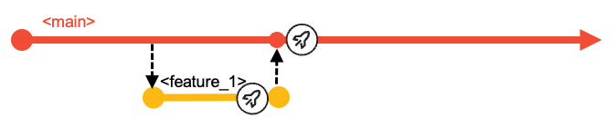

## Agenda

- Aims and Assumptions
- Choosing a branching model and workflow
- Starting simple
- Scaling up
- Integration branches
- Delivering changes via a release
- Hot-fix for production
- Using an Epic branch

# Aims and Assumptions

Some aims and assumptions that guide our recommendations...

## "No baggage"

Well... travelling light perhaps!

- Are we *prescriptive* or just *opinionated*?
- We start with a recommendation
  - Confidently
- We question everything 
  - **YAGNI** - "you aren't gonna need it"
- We strive for simplicity
  - For each user's experience

## Scaling {.smaller}

- The workflow and branching scheme should both scale up and scale down.
  - Small teams with simple and infrequent changes will be able to easily understand, adopt, and have a good experience.
  - Large, busy teams with many concurrent activities will be able to plan, track, and execute with maximum agility using the same fundamental principles.

## Planning {.smaller}

- Planning and design activities as well as code development aim to align to a regular release cadence.

- There is no magic answer to managing large numbers of "in-flight" changes, so planning assumptions should aim as much as possible to complete changes quickly, ideally within one release cycle.

  - DevOps/Agile practices typically encourage that, where possible, development teams should strive to break down larger changes into sets of smaller, incremental deliverables that can each be completed within an iteration. This reduces the number of "in-flight" changes, and allows the team to deliver value (end-to-end functionality) more quickly while still building towards a larger development goal.

- We know it is sometimes unavoidable for work to take longer than one release cycle and we accommodate that as a variant of the base workflow.

# The Branching Strategy

## Starting Simple {.smaller}

Every change starts in a branch.

- Developers work in the branch to make changes, perform user builds and unit tests.

- A branch holds multiple commits (changes to multiple files).

## Starting Simple {.smaller}

Every change starts in a branch.

These branches are 

- built,
- tested, 
- reviewed and 
- approved before merging to `main`.

## Merging into `main` {.smaller}

Feature Team/Developers will:

- Build
  - Builds may be done to any commit on any branch
  - Feature branch **must** build cleanly for a Pull Request
- Test
  - To prove quality of the changes in their feature branch

Create a Pull Request (PR) to signal to Team Leaders/Release Controllers to:

- Review
  - Code and Test results
- Approve
  - Safeguard the quality of `main`

## Before you ask... no, no *Production* branch

We have no branches named `prod` (or `test` or `QA`)

- Those are *environments* to which builds can be deployed
- Such extra branches:
  - are unnecessary
  - cause ambiguity
  - impose merging and building overheads

## Release branches

Any point in the history of `main` can be declared a *release candidate*.

- Build a *release candidate* package
- Test it
- Deploy it

Tag the commit (point in `main`'s history) with a release name.

A *release maintenance* branch will be used if *hot-fixes* must be developed and delivered.

## Release branches

## Scaling up

Concurrent *feature* branches scale very well, but assume short cycle times.

- Ideally live within a release delivery cycle
- But no big deal if they don't

*Epic* branches can collect multiple features

- Before going to `main`
- When the delivery is planned beyond the next release

(*Epic* branches are a form of *integration* branch.)

## Integration branches

# Worflows supported by the strategy

## Delivering changes via a release

## Hot-fix for production

## Using an Epic branch