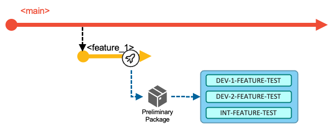
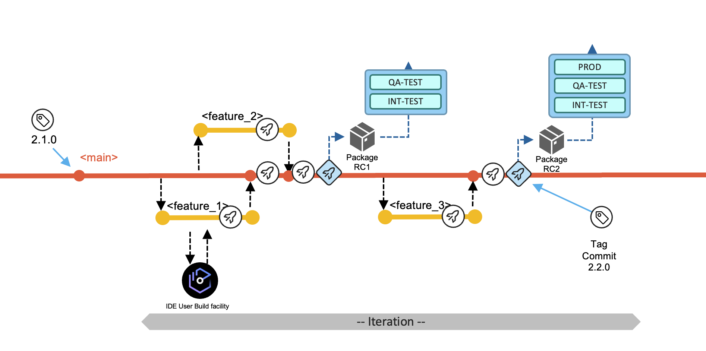
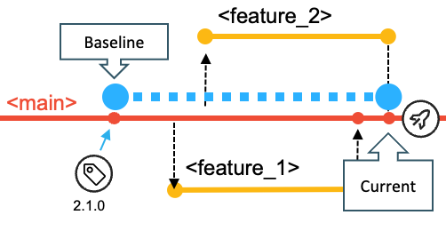

## Agenda

- Aims and Assumptions
- Fundamentals of the branching strategy
- Supported workflows
- Implementing pipelines 

# Aims and Assumptions

Some aims and assumptions that guide our recommendations...

## No baggage

Well... *"travel light"* perhaps!

- Are we *prescriptive* or just *opinionated*?
- We start with a recommendation
  - Confidently
- We question everything 
  - **YAGNI** - "you aren't gonna need it"
- We strive for simplicity
  - For each user's experience

## Scaling {.smaller}

- The workflow and branching scheme should both scale up and scale down.
  - Small teams with simple and infrequent changes will be able to easily understand, adopt, and have a good experience.
  - Large, busy teams with many concurrent activities will be able to plan, track, and execute with maximum agility using the same fundamental principles.

## Planning {.smaller}

- Planning and design activities as well as code development aim to align to a regular release cadence.

- The cadence of the next planned release is defined by the application team.

- There is no magic answer to managing large numbers of "in-flight" changes, so planning assumptions should aim as much as possible to complete changes quickly, ideally within one release cycle.

  - DevOps/Agile practices typically encourage that, where possible, development teams should strive to break down larger changes into sets of smaller, incremental deliverables that can each be completed within an iteration. This reduces the number of "in-flight" changes, and allows the team to deliver value (end-to-end functionality) more quickly while still building towards a larger development goal.

- We know it is sometimes unavoidable for work to take longer than one release cycle and we accommodate that as a variant of the base workflow.

# The Branching Strategy

## Starting Simple {.smaller}

Every change starts in a branch.

- Developers work in the branch to make changes, perform user builds and unit tests.

- A branch holds multiple commits (changes to multiple files).

## Starting Simple {.smaller}

Every change starts in a branch.

These changes on these branches are 

- built,
- tested, 
- reviewed and 
- approved before merging to `main`.

## Merging into `main` {.smaller}

Feature Team/Developers will:

- Build
  - Builds may be done to any commit on any branch
  - Feature branch **must** build cleanly for a Pull Request
- Test
  - To prove quality of the changes in their feature branch

Create a Pull Request (PR) to signal to Team Leaders/Release Controllers to:

- Review
  - Code and Test results
- Approve
  - Safeguard the quality of `main`

## Before you ask... no, no *Production* branch {.smaller}

CI/CD is relying on the fact of decoupling the building and deploying to any number of test environments and finally production.

We have no branches named `prod` (or `test` or `QA`)

- Those are *environments* to which builds can be deployed
- Such extra branches:
  - are unnecessary
  - cause ambiguity
  - impose merging and building overheads

- Deployment manager is maintaining what is deployed where and provides traceability to 

## Testing a release candidate {.smaller}

Any point in the history of `main` can be declared a *release candidate*.

- Build a *release candidate* package
- Deploy it
- Test it

Tag the commit (point in `main`'s history) with a release name.

## Deploying to production {.smaller}

When all the committed work items for the next planned release are ready to be shipped, and all quality gates have passed successfully and the required approvals have been issued by the appropriate reviewers, the release package and be deployed to production.

Tag the commit (point in `main`'s history) with a release name.

## Release maintenance branches {.smaller}

A *release maintenance* branch will be used if *hot-fixes* must be developed and delivered.

## Scaling up {.smaller}

Concurrent *feature* branches scale very well, but assume short cycle times.

- Ideally live within a release delivery cycle
- But no big deal if they don't

*Epic* branches can collect multiple features

- Before going to `main`
- When the delivery is planned beyond the next release

(*Epic* branches are a form of *integration* branch.)

## Integration branches {.smaller}

# Workflows supported by the strategy 

## The types of workflows {.smaller}

1) Work and focus on the **next planned release** via the `main` branch. After planning the work items for the next release, the development team is adding changes to the main branch.

2) **Resolution of a production problem** in the currently-released version of the application by leveraging a release maintenance branch that is used for maintenance purposes,
   
3) **concurrent development activities for significant development initiatives**, which include multiple planned work items for a later delivery (including starting development of a future release) by creating an epic branch from a commit point in the history of main.

## Hot-fix for production {.smaller}

* The process of urgent fixes for modules in the production environment follows the fix-forward approach, rather than rolling back the affected modules and reverting to the previous deployed state.

* The development team starts this process by creating a **release maintenance** branch of the git tag that represents the most recent release, that was deployed to production. 

## Building the fix package {.smaller}
* Changes contributed to the release maintenance branch are build and packaged.
* The fix package is tested in the appropriate test env
* Finally deployed to production

* The commit is tagged as the new version `2.1.1`.

## Using the Epic branch workflow

Dealing with significant development initiatives like

* Updates in regulatory frameworks
* Start the development phase of *subsequent* releases

-> A process to work independently from the default workflow.

## Epic branch workflow

## Guidelines and policies in the epic branch workflow

* Frequently merge updates from `main` into the epic branch to avoid making the merge of the `epic` branch into `main` difficult.

* Preliminary packages must not be deployed to a production runtime.

# Pipeline implementations {.smaller}

## Pipeline principles  {.smaller}

Git tags are leveraged to calculate the changes for the next planned release

Packages are always cumulative.

## Basic Build pipeline 

* (Typically) runs on each commit added to the history of a branch
* Produces a preliminary package that is stored in a binary repository
* May include an automated step to install it into the DEV-TEST environment

## Release Pipeline

* Produces binaries optimized for performance
* (Typically) is manually requested by the development team when a level of stability is reached
* produces a release candidate package that can be deployed to higher test environments.

# Collateral