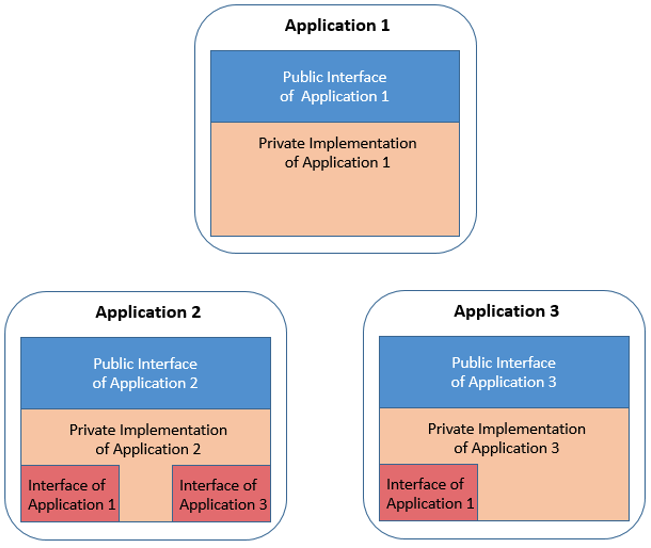

# Planning repository layouts

Because the traditionally large and monolithic nature of enterprise applications can slow down development both at the organizational level and the individual developer level, many enterprises take the migration to Git as an opportunity to examine how they can break their monolithic applications down into more agile functional Git repositories. The repository layout in the source code management (SCM) component of the continuous integration/continuous delivery (CI/CD) pipeline affects other pipeline components in several ways:

- Repository layout affects the developer experience, as it impacts the level of isolation for development activities - in other words, how much of your development can happen independently of code or components managed in other repositories.
- The scope of the build is typically defined by what is included inside a repository versus outside of it. For shared resources such as copybooks, other repositories might need to be pulled in.
- The scope of the package sent to the artifact repository will depend on the outputs produced by the build step.

## Basic components in a Git SCM layout

At a high level, the Git SCM can be thought of in two components: the central Git provider, which is the source from which developers will be pulling code from and pushing code to when they do their development work, and the clone on the developer workstation.

Within the central Git provider, there can be multiple organizations:

- Each organization can have multiple repositories inside it.
- In turn, each repository can have multiple branches (or versions) of the code in the repository.
- Each branch has a full copy of the files and folders in the codebase, allowing each developer to focus on their development task in isolation on a dedicated branch, only needing to worry about upstream and downstream impacts when they are ready to integrate those with their work.

On the developer's workstation, the developer will have however many repositories they have decided to clone down onto their local computer to work with. Each local repository clone has one or more branches that they have checked out (or in other words, selected to work with). And once again, each branch will have a full copy of the files and folders in the codebase.

## Working with Git

Git is a distributed version control system, so rather than the files all staying in the mainframe during development, developers will clone the repository they are interested in down to their local workstation. Your organization's administrator(s) can control who has what permissions, or which repositories each developer has access to.

Working with a distributed version control system like Git also means that when planning the SCM layout, one factor to consider is size. Generally, you want to avoid doing something like migrating the entire codebase of a large application into one repository, because that will mean that every time your developers want to clone or update the repository, it will take a long time to transfer all the code, which will make development feel slow and cumbersome rather than light and agile.

## Visualizing the SCM layout

Traditionally, mainframe applications are often seen as a monolith, but as mentioned previously, it is generally not preferable to have all of your codebase in one giant repository. To begin thinking about how to separate an application "monolith" into different repositories and designing your SCM layout, you can start to think about boundaries within your application, which are formed by things such as responsibilities and ownership.

To use an analogy, you can think of the application like a large capital city. On the surface, it might seem like this city is one big entity - a big monolith. However, upon closer inspection, the city is broken up into districts. And while each district has its own workings (for example, each district has its own school system), all of these districts are connected by a broader infrastructure in a controlled way. There might be public transport, such as a metro or buses, which run on predefined paths and schedules. We can think of this transport infrastructure like the data flowing between application boundaries within a larger system.

In a similar sense, the districts within the city could be likened to groupings of related files and programs, which can be formed into their own smaller applications (in a loose sense of the term) with data flowing between them.

The following diagram illustrates the point more literally. In this example, there are three applications, which we can again think of like the city districts:

- Each application has its own inner workings in the private implementation (represented by the tan parts of the above diagram). In the city analogy, an example of this could be the school system each district has. In the mainframe context, an example of these inner workings could be the COBOL programs for that application.
- Additionally, each application needs to be able to communicate with other applications, which is accomplished via its public interface (shown in blue on the diagram). Using the city analogy again, the bus stop for each district could be considered as the district's "public interface". In the mainframe context, the public interface could be the copybooks defining data structures that are passed between programs.
- Because each application needs to know how to interact with the other applications, the application also includes usage of interfaces from the other applications (shown in red on the diagram). This can be likened to the application needing to know the bus stops and schedule from the other applications.

Typically, with this layout, each application would have its own Git repository with its own scope. Compared to putting the whole system in a single large Git repository, having these smaller repositories enables more agile development practices. Companies choose a central, web-based repository server where they can manage their repositories, and from which their developers will clone from (for example, Git providers such as GitHub, GitLab, Bitbucket, Azure Repos, and so on). The following section provides some guidance to consider when breaking down a monolithic codebase to achieve this kind of setup.

## Guidelines for Git repository scope

The guidelines in this section can be used when considering how to cluster your codebase into Git repositories in a way that makes sense and encourages a streamlined workflow for your organization. There are several factors to balance when scoping repositories, including the following:

- Access control
  - Consider who (or which teams) need access to which files. Read/write, read-only, and restricted permissions need to be preserved, and this can be achieved by separating the files into different Git repositories and then managing access accordingly through your Git provider.
- Functional areas of the code
  - In your current system, if different teams work on different components of your application, it might make sense to make boundaries based on that. An individual can be part of one or several teams.
- Decoupling
  - Consider decoupling applications where it makes sense to do so. This allows different functional areas to have separate release cycles, which can help promote more agility in the overall organization.
- Interfaces
  - When scoping for Git repository layouts, consider if or how changes performed by a team in one repository might impact other teams. In other words, within a team, if a developer on that team makes a breaking change to their repository (for example, to the application's private implementation), they can just work with their team to fix it. However, if a developer makes breaking changes impacting another team (for example, to the application's public interface), then resolving it can become more complicated.
- Size
  - Consider the scope of changes for a typical change request (or pull request/merge request). For example, it is typically preferable to avoid change requests spanning across multiple repositories. Git providers usually have built-in review and approval mechanisms, so it is recommended to set up the repository layout in a way where these approval and review systems will make sense.
- Performance
  - Git performance can be a consideration, but it should not be the primary driver to make decisions when organizing repository layouts.

## Managing dependencies between applications

One of the challenges in designing the SCM layout is managing dependencies between applications. For mainframe applications, this means needing to think about how the files are arranged. If a program and its subprogram are located in the same application, then it will be an internal dependency. If they are located in different applications, then the dependency will be external.

In distributed development, for example with Java, you can reference other external applications by referencing their application programming interfaces (APIs). However, with COBOL (and other mainframe languages), the build process needs to physically pull in the external dependencies as source, via concatenation. Therefore, this is something you will want to consider when designing your SCM layout.

To help guide the SCM layout design process, we can approach the SCM design with a two-step process:

1. Define which files make up each application: This is like defining the "districts" in your city, if we go back to the city analogy. You can consider looking at boundaries that have already naturally arisen based on ownership and responsibility around different parts of the codebase, in addition to the other [guidelines for repository scope](#guidelines-for-git-repository-scope).
    - You might already have an idea of which files make up each application based on a data dictionary.
    - IBM Application Discovery & Delivery Intelligence (ADDI) can assist in visualizing call graphs and clusters of dependencies in your codebase. These visualizations can be useful when you are analyzing the code to figure out how to organize it.
2. Understand the internal versus external elements (such as copybooks) for each application: Here, the objective is to identify interfaces and shared items across application scopes - in other words, we want to determine which application is using which copybooks. In the city analogy, this is like identifying the bus stop names. Based on the repository layout, you can minimize how much changes in one repository will impact other repositories (and in turn, other teams and applications). Ideally, you will end up with files that have a lot of references within the same repository.

The result of the analysis in the steps above can be reflected within each application's repository. In the following example, you can see that the file structure is organized to indicate private versus public files and interfaces.

More details about managing dependencies can be found in the documentation for [Defining dependency management](./dependency-management.md).
